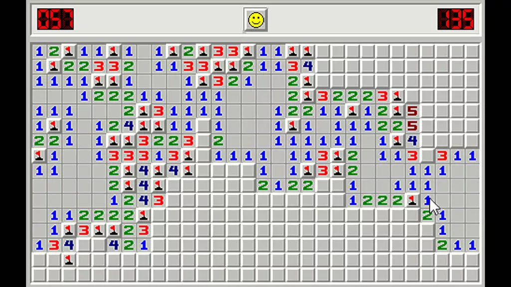

## Introduction

If you're a millennial, chances are you played a Windows game called Minesweeper
growing up. The premise is deceptively simple: a grid of covered squares hides a
set number of mines, and your job is to uncover all the safe squares without
triggering one. When you click a square, it either reveals a number — indicating
how many of its neighboring squares contain mines — or ends the game in an
explosion. Using those numbers, you reason about which adjacent squares are safe
to click and which are likely deadly. The further you get, the more information
you have, and the more confident your next move becomes. At its heart, Minesweeper
is a game of inference under uncertainty. You build a mental model of where the
mines are hiding, and you use it to decide where to step next.

{width=80% fig-align="center"}

Bayesian Optimization is the Minesweeper of Machine Learning (ML). A typical ML
workflow involves defining an objective function — such as a loss function — and
then solving for its minimum or maximum using numerical methods based on its
derivatives. But there are cases where neither the objective function nor its
derivatives are known. For such black-box functions, the only option is to draw
samples in search of the optimal value. When samples are cheap to draw, a
grid-search approach — systematically evaluating many combinations of input
variables — works fine. But when samples are expensive, such as tuning the
hyperparameters of a deep neural network or drilling for oil at candidate
geographic coordinates, reaching the optimum with as few samples as possible
becomes critical.

That is where Bayesian Optimization (BO) shines. BO consists of two components:
a surrogate model — most commonly a Gaussian Process — and an acquisition
function. The Gaussian Process is like the revealed squares on the Minesweeper
grid, telling you what the landscape looks like around your observations. The
acquisition function is your reasoning about where to click next. And the mines?
They are the optimum values of your objective function.

## Gaussian Processes (GP) through the Lens of Regression

There are many ways to introduce Gaussian Processes, of which the most intuitive
to me is through the regression perspective.

Forget about Gaussian Processes for a minute. A typical regression workflow goes
like this:

$$\underbrace{D}_{\text{Data}} \rightarrow \underbrace{W}_{\text{Regression Parameters}} \rightarrow \underbrace{y}_{\text{Predictions}}$$

You use data to estimate regression parameters, then use the estimated parameters
to make predictions. To estimate the regression parameters $\mathbf{w}$, two
paradigms are most common:

$$\text{MLE:} \quad P(\mathbf{D}|\mathbf{w}) = \prod^n_{i=1}P(y_i|x_i,\mathbf{w})$$

$$\text{MAP:} \quad P(\mathbf{w}|\mathbf{D}) = \frac{P(D|\mathbf{w})P(\mathbf{w})}{z} \propto P(\mathbf{D}|\mathbf{w})P(\mathbf{w})$$

For inference tasks, the parameters are the most important since they embed the
relationship between the predictors and the outcome. However, both methods lead
to a single solution of $\mathbf{w}$. In fact, there are many $\mathbf{w}$ that
may fit the data well and are worth considering. This argument is stronger for
predictive tasks where the actual values of parameters $\mathbf{w}$ are less of
interest.

Bayesians say: let's go directly from data to predictions, accounting for the
variability of the parameters without having to estimate them:

$$\underbrace{D}_{\text{Data}} \rightarrow \underbrace{y}_{\text{Predictions}}$$

This leads to the posterior predictive distribution:

$$P(y_i|x_i,D) = \int_w P(y_i|x_i,w,D)\,dw$$

The equation says: for a test point $i$, we consider every possible value of the
regression parameters and take a weighted average of their predicted values by
integrating them out. The formula above can be further broken down into a product
of the likelihood and posterior:

$$P(y_i \mid x_i, D) = \int_w \underbrace{P(y_i \mid x_i, w)}_{\text{Likelihood}} \, \underbrace{P(w \mid D)}_{\text{Posterior}} \, dw$$

Here is where the magic happens. The likelihood $P(y_i|x_i,w)$ is Gaussian. The
posterior $P(w \mid D) = \frac{P(D|w)P(w)}{z}$, if we assume a Gaussian prior
$P(w)$ (just like we do with Ridge regression), is also Gaussian. Two Gaussians
multiplied together is still a Gaussian, so $P(y|x,D)$ is also a Gaussian!

Now that is just one test case. We can extend the same idea to more than one test
point:

$$P(y_* \mid D, \mathbf{x}) \sim \mathcal{N}(\mu_{y_*|D}, \Sigma_{y_*|D})$$

where $y_*$ is the test dataset.

### Gaussian Processes Assumption

Now the question becomes: how do we find $\mu_{y_*|D}$ and $\Sigma_{y_*|D}$? The
key assumption is that our training data and test data **jointly** follow a
**multivariate normal distribution (MVN)**:

$$P\left(\begin{bmatrix} y_1 \\ \vdots \\ y_n \\ y_* \end{bmatrix}, (x_1, \ldots, x_n), x_*\right) \sim \mathcal{N}(\mu, \Sigma)$$

where the covariance matrix $\Sigma$ is represented via a kernel function $K$,
with $K_{ij} = k(x_i, x_j)$:

$$\Sigma = \begin{bmatrix} K & K_* \\ K_*^T & K_{**} \end{bmatrix}$$

- $K$ — an $n \times n$ matrix of kernel evaluations between all pairs of training
  points, where entry $K_{ij} = k(x_i, x_j)$. This is the covariance structure
  among the observed data.
- $K_*$ — an $n \times 1$ vector of kernel evaluations between each training point
  and the test point $x_*$, where entry $K_{*i} = k(x_i, x_*)$. This is what
  links the training data to the test point.
- $K_*^T$ — the transpose of $K_*$, a $1 \times n$ vector. It appears in the
  lower left to keep the matrix symmetric, as a covariance matrix must be.
- $K_{**}$ — a scalar, the kernel evaluation of the test point with itself,
  $k(x_*, x_*)$. This is the prior variance of the test point before seeing any
  data.

And what about Gaussian Processes? They are essentially MVN. The posterior
predictive distribution can now be defined as follows (math derivation omitted):

$$P(y_* \mid D, \mathbf{x}) \sim \mathcal{N}(\mu_{y_*|D}, \Sigma_{y_*|D})$$

where

$$\mu_{y_*|D} = K_*^T(K + \sigma^2 I)^{-1}y$$

and

$$\Sigma_{y_*|D} = K_{**} - K_*^T(K + \sigma^2 I)^{-1}K_*$$

### Gaussian Noise

In the example above, we treat the observed values $y$ as the true values of the
underlying function $f$. However, in many applications this is not the case. The
observed values are noisy, with an independent noise term layered on top:

$$\hat{Y}_i = f_i + \epsilon_i$$

In this case the covariance matrix becomes $\hat{\Sigma} = \Sigma + \sigma^2\mathbf{I}$,
and the Gaussian Process posterior distribution leads to:

$$Y_* \mid (Y_1 = y_1, \ldots, Y_n = y_n, \mathbf{x}_1, \ldots, \mathbf{x}_n) \sim \mathcal{N}\!\left(K_*^\top (K + \sigma^2 I)^{-1} y,\ K_{**} + \sigma^2 I - K_*^\top (K + \sigma^2 I)^{-1} K_*\right)$$

To bring everything full circle: we bypass the estimation of regression parameters
but are still able to make predictions. With some observed data, we can obtain a
distribution for the values of the test data.

Yet the assumption and formulation can seem odd. Why combine training and test
data? Why represent the covariance matrix with kernel functions? The core idea of
GP is that data points close to each other should yield similar results. Under the
GP framework, predictions are made by assuming all data come from the same
generative model and examining how close the test data are to the training data
via the kernel. It is analogous to estimating your house price based on the house
prices in your neighborhood — without building a specific regression model with
predictors like number of bedrooms or year built.

To think in MVN terms is a paradigm shift. In most regression settings, individual
data points are assumed to have their own distributions. In Gaussian Processes,
our data are counted only as a partial observation of one sample from an MVN. To
facilitate understanding, we now visit the origin of Gaussian Processes in
Stochastic Processes.

## Gaussian Processes (GP) through the Lens of Stochastic Processes

By [Wikipedia](https://en.wikipedia.org/wiki/Gaussian_process), a Gaussian Process
is a time continuous stochastic process $\{X_t; t \in T\}$ such that for every
finite set of indices $t_1, \ldots, t_k$ in the index set $T$,

$$\mathbf{X}_{t_1,\ldots,t_k} = (X_{t_1}, \ldots, X_{t_k})$$

is a multivariate Gaussian random variable. Essentially, GP observations are
never independent — although collected at different inputs, they are **jointly**
Gaussian, correlated with each other through the kernel function. The data points
collectively are one realization from the **joint** distribution:

$$\begin{bmatrix} f(x_1) \\ \vdots \\ f(x_n) \end{bmatrix} \sim \mathcal{N}(\mu, \Sigma)$$

The covariance structure encoded in $K$ means that observing $f(x_i)$ says
something about $f(x_j)$ for nearby $x_j$. The most common choice for the
covariance structure is the Radial Basis Function (RBF) kernel:

$$k(x_i, x_j) = \sigma^2\exp\left(-\frac{\|x_i - x_j\|^2}{2\ell^2}\right)$$

## Gaussian Processes Visualized

We have now discussed two views of Gaussian Processes. The **Conditional View**:
after observing some points, the remaining points follow an updated Gaussian —
the posterior predictive distribution from the regression perspective. And the
**Joint View**: all observations together are one draw from a multivariate
Gaussian, corresponding to the stochastic process perspective.

In this section, we code GPs in Python to generate plots of both views using the
RBF kernel.

```{python}
#| label: imports
#| message: false

import numpy as np
import scipy
import scipy.spatial.distance
import itertools
import matplotlib.pyplot as plt
import matplotlib.gridspec as gridspec
from matplotlib.figure import Figure
from matplotlib.gridspec import SubplotSpec
from mpl_toolkits.axes_grid1 import make_axes_locatable
from numpy import ndarray as KernelMatrix
from scipy.stats.qmc import LatinHypercube
```

```{python}
#| label: gp-class

class GPreg:

    def __init__(self, X_train, y_train, X_test, length_scale=1, amplitude=1, keps=1e-8):
        self.L = length_scale
        self.A = amplitude
        self.keps = keps
        self.muFn = self.mean_func(X_test)
        self.Kfn = self.kernel_func(X_test, X_test, amplitude=self.A, length_scale=self.L) + 1e-15 * np.eye(np.shape(X_test)[0])
        self.X_train = X_train
        self.y_train = y_train
        self.X_test = X_test
        self.y_test = np.sin(X_test)

    def mean_func(self, X):
        """Zero mean function."""
        return np.zeros((np.shape(X)[0], 1))

    def kernel_func(self, x, z, amplitude=1, length_scale=1):
        """RBF (squared exponential) kernel."""
        sq_dist = scipy.spatial.distance.cdist(x, z, metric='sqeuclidean')
        return amplitude**2 * np.exp(-0.5 * sq_dist / length_scale**2)

    def compute_posterior(self):
        K = self.kernel_func(self.X_train, self.X_train, amplitude=self.A, length_scale=self.L) + self.keps * np.eye(np.shape(self.X_train)[0])
        K_s = self.kernel_func(self.X_train, self.X_test, amplitude=self.A, length_scale=self.L)
        K_ss = self.kernel_func(self.X_test, self.X_test, amplitude=self.A, length_scale=self.L) + self.keps * np.eye(np.shape(self.X_test)[0])
        K_inv = np.linalg.inv(K)
        self.muFn = np.dot(K_s.T, np.dot(K_inv, self.y_train))
        self.Kfn = K_ss - np.dot(K_s.T, np.dot(K_inv, K_s))
        return None

    def generate_random_prior_plots(self, num_points=40, num_samples=5):
        """Plot prior GP samples."""
        X = np.expand_dims(np.linspace(-4, 4, num_points), 1)
        sigma = self.kernel_func(X, X, amplitude=self.A, length_scale=self.L)
        Y = np.random.multivariate_normal(mean=np.zeros(num_points), cov=sigma, size=num_samples)
        plt.figure(figsize=(6, 4))
        for i in range(num_samples):
            plt.plot(X, Y[i], linestyle="-", marker="o", markersize=3)
        plt.xlabel("$x$", fontsize=13)
        plt.ylabel("$y = f(x)$", fontsize=13)
        plt.title(
            f"{num_samples} different function realizations at {num_points} points\n"
            "sampled from a Gaussian process with exponentiated quadratic kernel"
        )
        plt.xlim([-4, 4])
        plt.show()

    def generate_posterior_plots(self, X, num_samples=3):
        """Plot posterior distribution and samples."""
        fig, (ax1, ax2) = plt.subplots(nrows=2, ncols=1, figsize=(6, 6))
        ax1.plot(X, np.sin(X), "b--", label="$\sin(x)$")
        ax1.fill_between(
            X.flatten(),
            self.muFn.flatten() - 2 * np.sqrt(np.diag(self.Kfn)),
            self.muFn.flatten() + 2 * np.sqrt(np.diag(self.Kfn)),
            color="red", alpha=0.15, label=r"95% CI — $2\sigma_{test|train}$",
        )
        ax1.plot(X, self.muFn, "r-", lw=2, label=r"$\mu_{test|train}$")
        ax1.plot(self.X_train, self.y_train, "ko", linewidth=2, label="$(x_{train}, y_{train})$")
        ax1.set_xlabel("$x$", fontsize=13)
        ax1.set_ylabel("$y$", fontsize=13)
        ax1.set_title("Posterior predictive distribution")
        ax1.legend()
        ax2.plot(X, np.random.multivariate_normal(mean=self.muFn.flatten(), cov=self.Kfn, size=5).T, "-")
        ax2.set_xlabel("$x$", fontsize=13)
        ax2.set_ylabel("$y$", fontsize=13)
        ax2.set_title("5 function realizations from the posterior GP")
        ax2.set_xlim([X.min(), X.max()])
        plt.tight_layout()
        plt.show()
```

### Joint View

Each curve below represents one GP sample, with 40 observed points shown and
infinitely many unobserved points implied. One collection of 40 data points is
only a partial observation of one realized function.

```{python}
#| label: joint-view

X_train_1d = np.array([[1], [2.7], [3.2], [4.1], [5]]).reshape(-1, 1)
y_train_1d = np.sin(X_train_1d)
X_test_1d = np.linspace(0, 6, 100).reshape(-1, 1)

gp = GPreg(X_train_1d, y_train_1d, X_test_1d, 1, 1, 1e-8)
gp.generate_random_prior_plots()
```

### Conditional View — Posterior Predictive Distribution

Suppose we have a function $f(x) = \sin(x)$ for which we have observed the values
at several data points, and we hope to build a posterior predictive distribution
over the entire space. Plugging the observed values into the posterior predictive
formula:

$$Y_* \mid (Y_1 = y_1, \ldots, Y_n = y_n, \mathbf{x}_1, \ldots, \mathbf{x}_n) \sim \mathcal{N}\!\left(K_*^\top (K + \sigma^2 I)^{-1} y,\ K_{**} + \sigma^2 I - K_*^\top (K + \sigma^2 I)^{-1} K_*\right)$$

we get the posterior predictive distribution at each test point:

```{python}
#| label: conditional-view

gp.compute_posterior()
gp.generate_posterior_plots(X_test_1d, 5)
```

The characteristic football/sausage shape reflects low variance around observed
values and high variance for points far from the training data. Statistically,
95% of samples drawn from the posterior should fall within the shaded 95%
confidence interval.

### Why Conditioning Reduces Variance

With a GP, the closer $x_*$ is to the training points, the more confident the
model becomes, and thus the more variance gets reduced. But why? What role does
the kernel play? Let's unpack the math behind the posterior covariance.

The posterior covariance of a test point $x_*$ given training data is:

$$\Sigma_{y_*|D} = K_{**} - K_*^T K^{-1} K_*$$

where $K_{**}$ is the *prior* variance of $x_*$ — the uncertainty before seeing
any data — and $K_*^T K^{-1} K_*$ is the variance *removed* by the training
points. Assume $n$ training points and a single test point $x_*$, with $K$ as
$n \times n$, $K_*$ as $n \times 1$, and $K_*^T$ as $1 \times n$. The full
product is a scalar:

$$K_*^T K^{-1} K_* = \underbrace{(1 \times n)}_{K_*^T} \underbrace{(n \times n)}_{K^{-1}} \underbrace{(n \times 1)}_{K_*} = (1 \times 1)$$

Given the [positive definite](https://en.wikipedia.org/wiki/Definite_matrix)
nature of kernels, this quantity is always positive — it can be thought of as the
total amount of variance removed from the test data.

To see how much variance is removed, let's examine the quantity with three training
points $(x_1, x_2, x_3)$ and one test point $x_*$. Set $a = k(x_*, x_1)$,
$b = k(x_*, x_2)$, $c = k(x_*, x_3)$, with $m_{ij}$ denoting entries of $K^{-1}$:

$$K_*^T K^{-1} K_* = \begin{bmatrix} a & b & c \end{bmatrix}
\begin{bmatrix} m_{11} & m_{12} & m_{13} \\ m_{21} & m_{22} & m_{23} \\
m_{31} & m_{32} & m_{33} \end{bmatrix}
\begin{bmatrix} a \\ b \\ c \end{bmatrix}
= m_{11}a^2 + m_{22}b^2 + m_{33}c^2 + 2m_{12}ab + 2m_{13}ac + 2m_{23}bc$$

The **squared terms** $a^2, b^2, c^2$ capture how similar $x_*$ is to each
individual training point. The **cross terms** $ab, ac, bc$ capture interactions
between $x_*$'s relationships to different training points and are treated as
constants driven by the training data structure.

With the RBF kernel, each similarity score $k(x_*, x_i)$ approaches 1 when
$x_*$ is close to $x_i$ and 0 when far away. This means one nearby training
point gives moderate variance reduction; two nearby training points give larger
reduction; and no nearby training points means the GP falls back to its prior.
The variance reduction is therefore a **vote** from each training point, weighted
by proximity to $x_*$. GP uncertainty is *locally determined* — confidence builds
up around observed points and fades in unexplored regions. As we will see in the
second blog of the series, this is exactly the signal the acquisition function
uses to decide where to sample next.

## Higher Dimension GP

So far we have focused on simple 1D examples. In the real world, data points come
in much higher dimensions. The distance calculation remains the same: for each
pair of data points, we take the distances across each feature and compute the
norm of the difference vector. The example below extends the GP to a 2D input
space, modeling the underlying function $f(x_1, x_2) = x_1 \exp(-x_1^2 - x_2^2)$.

```{python}
#| label: high-dim-gp
#| fig-width: 9
#| fig-height: 4
class HighDimGPreg:

    def __init__(self, X_train, y_train, X_test, L=1, A=1, keps=1e-8):
        self.L = L
        self.A = A
        self.keps = keps
        self.muFn = self.mean_func(X_test)
        self.Kfn = self.kernel_func(X_test, X_test) + 1e-15 * np.eye(X_test.shape[0])
        self.X_train = X_train
        self.y_train = y_train.reshape(-1, 1)
        self.X_test = X_test
        self.y_test = X_test[:, 0] * np.exp(-X_test[:, 0]**2 - X_test[:, 1]**2)

    def mean_func(self, X):
        """Zero mean function."""
        return np.zeros((X.shape[0], 1))

    def kernel_func(self, x, z):
        """RBF kernel with amplitude and length scale."""
        sq_dist = scipy.spatial.distance.cdist(x / self.L, z / self.L, metric='sqeuclidean')
        return self.A**2 * np.exp(-0.5 * sq_dist)

    def compute_posterior(self):
        K = self.kernel_func(self.X_train, self.X_train) + self.keps * np.eye(self.X_train.shape[0])
        K_s = self.kernel_func(self.X_train, self.X_test)
        K_ss = self.kernel_func(self.X_test, self.X_test) + self.keps * np.eye(self.X_test.shape[0])
        K_inv = np.linalg.inv(K)
        self.muFn = np.dot(K_s.T, np.dot(K_inv, self.y_train))
        self.Kfn = K_ss - np.dot(K_s.T, np.dot(K_inv, K_s))
        return None

    def generate_plots(self, X, nx):
        """Generate heatmap plots of the posterior mean and uncertainty."""
        mu = self.muFn.ravel()
        std = np.sqrt(np.diag(self.Kfn))
        fig, axes = plt.subplots(1, 2, figsize=(10, 4))
        im0 = axes[0].imshow(
            mu.reshape(nx, nx), origin='lower', cmap='viridis',
            extent=[X[:, 0].min(), X[:, 0].max(), X[:, 1].min(), X[:, 1].max()]
        )
        axes[0].set_title('Posterior Mean')
        axes[0].set_xlabel('$x_1$')
        axes[0].set_ylabel('$x_2$')
        plt.colorbar(im0, ax=axes[0])
        im1 = axes[1].imshow(
            std.reshape(nx, nx), origin='lower', cmap='plasma',
            extent=[X[:, 0].min(), X[:, 0].max(), X[:, 1].min(), X[:, 1].max()]
        )
        axes[1].set_title('Posterior Std Dev (Uncertainty)')
        axes[1].set_xlabel('$x_1$')
        axes[1].set_ylabel('$x_2$')
        plt.colorbar(im1, ax=axes[1])
        plt.tight_layout()
        plt.show()


nx = 40
n_train = 10
sampler = LatinHypercube(d=2)
X_train_2d = sampler.random(n=n_train)
X_train_2d[:, 0] = (X_train_2d[:, 0] - 0.5) * 6 + 1
X_train_2d[:, 1] = (X_train_2d[:, 1] - 0.5) * 6 + 1
y_train_2d = X_train_2d[:, 0] * np.exp(-X_train_2d[:, 0]**2 - X_train_2d[:, 1]**2)

X_test_seq = np.linspace(-2, 4, nx)
x1, x2 = np.meshgrid(X_test_seq, X_test_seq)
X_test_2d = np.column_stack([x1.ravel(), x2.ravel()])

gp2d = HighDimGPreg(X_train_2d, y_train_2d, X_test_2d, L=1, A=1, keps=1e-8)
gp2d.compute_posterior()
gp2d.generate_plots(X_test_2d, nx=nx)
```

The **posterior mean** (left) shows the GP's best estimate of the underlying
function across the 2D input space. The color intensity represents the predicted
function value — warmer colors indicate higher values, cooler colors indicate
lower values. The surface is smooth, as expected from the RBF kernel.

The **posterior uncertainty** (right) shows the posterior standard deviation
$\sigma_{test|train}$ at each test point — the square root of the diagonal of
$\Sigma_{y_*|D}$. Dark regions indicate low uncertainty near the 10 Latin
Hypercube training points, where variance reduction is large. Bright regions
indicate high uncertainty far from all training points, where the posterior falls
back toward the prior. With only 10 training points over a 2D space, large
portions of the input space remain uncertain — illustrating precisely why efficient
sampling strategies like BO matter when evaluations are expensive.

## GP Kernels and Parameters

So far we have only used the RBF kernel:

$$k(x_i, x_j) = \sigma^2\exp\left(-\frac{\|x_i - x_j\|^2}{2\ell^2}\right)$$

where two hyperparameters are required: $\sigma$ (amplitude) and $\ell$
(lengthscale). In practice, these parameters are unknown and usually estimated
via Maximum Likelihood Estimation. A great reference is
[Gaussian processes (2/3) — Fitting a Gaussian process kernel](https://peterroelants.github.io/posts/gaussian-process-kernel-fitting/).

Each parameter affects the shape of the kernel function and the resulting GP.
Let's first look at how the parameters affect the kernel function itself:

```{python}
#| label: gp-kernel-distance
# Reference: Roelants, P. (2019). Gaussian Processes (3/3) - Exploring Kernels.
# https://peterroelants.github.io/posts/gaussian-process-kernels/

def exponentiated_quadratic(xa, xb, amplitude=1.0, length_scale=1.0):
    """RBF kernel with explicit hyperparameters."""
    sq_norm = scipy.spatial.distance.cdist(xa, xb, "sqeuclidean")
    return amplitude**2 * np.exp(-0.5 * sq_norm / length_scale**2)

xlim = (-4, 4)
X = np.expand_dims(np.linspace(*xlim, num=75), 1)
zero = np.array([[0.0]])

fig, ax = plt.subplots(figsize=(5.4, 3))
for ls, amp, label in [
    (1.0, 1.0, "$\\ell = 1$, $\\sigma = 1$"),
    (0.5, 1.0, "$\\ell = 0.5$, $\\sigma = 1$"),
    (1.0, 0.5, "$\\ell = 1$, $\\sigma = 0.5$"),
    (0.5, 0.5, "$\\ell = 0.5$, $\\sigma = 0.5$"),
]:
    Σ = exponentiated_quadratic(xa=zero, xb=X, amplitude=amp, length_scale=ls)
    ax.plot(X[:, 0], Σ[0, :], label=label)

ax.set_xlabel("$x_a - x_b$", fontsize=11)
ax.set_ylabel("$K(x_a,x_b)$", fontsize=11)
ax.set_title("Exponentiated quadratic kernel")
ax.set_ylim((0, 1.1))
ax.set_xlim(*xlim)
ax.legend(loc=1)
plt.tight_layout()
plt.show()
```

Now let's see how the parameters affect the GP samples themselves:

```{python}
#| label: gp-kernel-samples
# Reference: Roelants, P. (2019). Gaussian Processes (3/3) - Exploring Kernels.
# https://peterroelants.github.io/posts/gaussian-process-kernels/

def sample_from_kernel(
    covariance: KernelMatrix, nb_of_samples: int, nb_of_realizations: int
) -> KernelMatrix:
    """Draw sample functions from a covariance matrix."""
    return np.random.multivariate_normal(
        mean=np.zeros(nb_of_samples), cov=covariance, size=nb_of_realizations
    ).T


def plot_kernel(
    X: KernelMatrix, y: KernelMatrix, covariance: KernelMatrix,
    description: str, fig: Figure, subplot_spec: SubplotSpec,
    xlim: tuple[int, int], scatter: bool = False, rotate_x_labels: bool = False,
) -> None:
    """Visualize a kernel through samples and its covariance matrix."""
    grid_spec = gridspec.GridSpecFromSubplotSpec(
        1, 2, width_ratios=[2, 1], height_ratios=[1],
        wspace=0.18, hspace=0.0, subplot_spec=subplot_spec,
    )
    ax1 = fig.add_subplot(grid_spec[0])
    ax2 = fig.add_subplot(grid_spec[1])
    if scatter:
        for i in range(y.shape[1]):
            ax1.scatter(X, y[:, i], alpha=0.8, s=3)
    else:
        for i in range(y.shape[1]):
            ax1.plot(X, y[:, i], alpha=0.8)
    ax1.set_ylabel("$y$", fontsize=13, labelpad=0)
    ax1.set_xlabel("$x$", fontsize=13, labelpad=0)
    ax1.set_xlim(xlim)
    if rotate_x_labels:
        for label in ax1.get_xticklabels():
            label.set_rotation(30)
    ax1.set_title(f"Samples from {description}")
    im = ax2.imshow(covariance, cmap="YlGnBu")
    divider = make_axes_locatable(ax2)
    cax = divider.append_axes("right", size="5%", pad=0.02)
    cbar = plt.colorbar(im, ax=ax2, cax=cax)
    cbar.ax.set_ylabel("$K(X,X)$", fontsize=8)
    ax2.set_title(f"Covariance matrix\n{description}")
    ax2.set_xlabel("X", fontsize=10, labelpad=0)
    ax2.set_ylabel("X", fontsize=10, labelpad=0)
    nb_ticks = 5
    ticks = list(range(xlim[0], xlim[1] + 1))
    ticks_idx = np.rint(
        np.linspace(1, len(ticks), num=min(nb_ticks, len(ticks))) - 1
    ).astype(int)
    ticks = list(np.array(ticks)[ticks_idx])
    ax2.set_xticks(np.linspace(0, len(X) - 1, len(ticks)))
    ax2.set_yticks(np.linspace(0, len(X) - 1, len(ticks)))
    ax2.set_xticklabels(ticks)
    ax2.set_yticklabels(ticks)
    if rotate_x_labels:
        for label in ax2.get_xticklabels():
            label.set_rotation(30)
    ax2.grid(False)


def plot_kernel_combinations(amplitudes, length_scales, nb_of_samples=150, nb_of_realizations=3):
    """Plot GP samples and covariance matrices for all combinations of hyperparameters."""
    xlim = (-4, 4)
    X = np.expand_dims(np.linspace(*xlim, nb_of_samples), 1)
    combinations = list(itertools.product(amplitudes, length_scales))
    n_combos = len(combinations)
    fig = plt.figure(figsize=(7, 2.5 * n_combos))
    gs = gridspec.GridSpec(n_combos, 1, figure=fig, wspace=0.2, hspace=0.4)
    for i, (amplitude, length_scale) in enumerate(combinations):
        Σ = exponentiated_quadratic(xa=X, xb=X, amplitude=amplitude, length_scale=length_scale)
        y = sample_from_kernel(covariance=Σ, nb_of_samples=nb_of_samples, nb_of_realizations=nb_of_realizations)
        plot_kernel(
            X=X, y=y, covariance=Σ,
            description=f"$\\ell = {length_scale}$, $\\sigma = {amplitude}$",
            fig=fig, subplot_spec=gs[i], xlim=xlim,
        )
    plt.suptitle("Exponentiated quadratic kernel", y=0.99)
    fig.subplots_adjust(left=0.07, bottom=0.04, right=0.93, top=0.94)
    plt.show()


plot_kernel_combinations(amplitudes=[1.0, 10.0], length_scales=[0.5, 1.0, 2.0])
```

The RBF kernel has two hyperparameters: the length scale $\ell$ and the amplitude
$\sigma$. The six plots above correspond to all combinations of
$\sigma \in \{1, 10\}$ and $\ell \in \{0.5, 1, 2\}$, generated by
`itertools.product` in this order:

| Plot | $\sigma$ | $\ell$ |
|:----:|:--------:|:------:|
| 1    | 1.0      | 0.5    |
| 2    | 1.0      | 1.0    |
| 3    | 1.0      | 2.0    |
| 4    | 10.0     | 0.5    |
| 5    | 10.0     | 1.0    |
| 6    | 10.0     | 2.0    |

**Length scale $\ell$ controls the smoothness of the function.** At $\ell = 0.5$
(plots 1, 4), the sampled functions are highly wiggly — only points within 0.5
units of each other are considered similar, so the function changes direction
rapidly. At $\ell = 1$ (plots 2, 5), functions are smooth at a moderate pace.
At $\ell = 2$ (plots 3, 6), the functions are very slow-moving — points up to 2
units apart remain highly correlated, producing long sweeping curves. In the
covariance matrix, a larger $\ell$ spreads correlations further from the diagonal,
making the matrix appear more uniformly bright. A smaller $\ell$ concentrates
correlation near the diagonal.

**Amplitude $\sigma$ controls the vertical scale of the function.** At $\sigma = 1$
(plots 1–3), function values stay roughly within $[-1, 1]$. At $\sigma = 10$
(plots 4–6), they can swing as wide as $[-10, 10]$, while the smoothness pattern
mirrors plots 1–3 exactly since $\ell$ is unchanged. Comparing plot 1
($\ell=0.5$, $\sigma=1$) to plot 4 ($\ell=0.5$, $\sigma=10$): identical
wiggliness, but the vertical range is inflated by a factor of 10. $\sigma$ scales
the entire kernel matrix by $\sigma^2$, inflating variance at every point without
touching the correlation structure. Think of $\ell$ as controlling the *shape* of
the functions and $\sigma$ as controlling their *range*.

## Conclusion

Gaussian Processes are a powerful and elegant tool for modeling uncertainty.
Starting from the regression perspective, we saw how integrating out the parameters
leads naturally to the posterior predictive distribution — a Gaussian whose mean
and covariance are fully defined by the kernel function. From the stochastic
processes perspective, we saw that a GP treats the entire function as a single
draw from a multivariate Gaussian, where observations are jointly correlated
rather than independent.

The kernel function is the engine of the GP. It encodes how information propagates
from observed points to unobserved ones. The closer a test point is to the training
points, the more confident the model becomes, and the more variance gets reduced.
This variance reduction is not magic — it is a weighted sum of similarities,
driven entirely by how close a test point is to the training data.

Back to the Minesweeper analogy: the GP is your mental model of the board. Each
observation updates your belief about the surrounding landscape, narrowing
uncertainty near revealed squares and leaving it wide open in unexplored corners.
In the next blog of the series, we will see how the acquisition function uses that
uncertainty map to decide where to click next — and how the full Bayesian
Optimization loop comes together.

## References

- P. Roelants. [Gaussian Processes Tutorial.](https://peterroelants.github.io/posts/gaussian-process-tutorial/) 2019.

- P. Roelants. [Gaussian Processes (3/3) — Exploring Kernels.](https://peterroelants.github.io/posts/gaussian-process-kernels/) 2019.

- K. Weinberger. [Gaussian Processes.](https://www.cs.cornell.edu/courses/cs4780/2018fa/lectures/lecturenote15.html) Cornell CS4780 Machine Learning Lecture Notes. 2018.

- M. Krasserm. [Bayesian Optimization.](https://krasserm.github.io/2018/03/21/bayesian-optimization/#Optimization-algorithm) 2018.

- R. B. Gramacy. [Surrogates: Gaussian Process Modeling, Design, and Optimization for the Applied Sciences, Chapter 5.](https://bookdown.org/rbg/surrogates/chap5.html) Chapman Hall/CRC, 2020.
