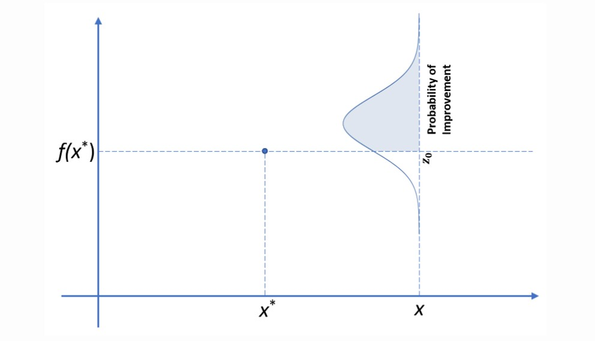
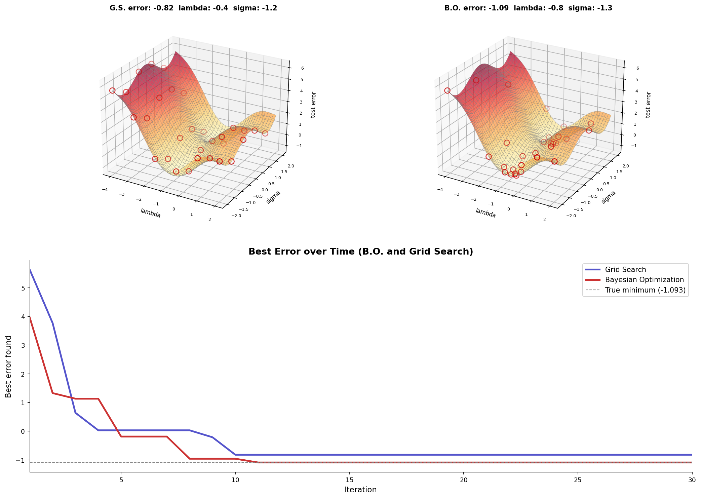

## Introduction

In the first post of the series, we introduced the concept of Gaussian Processes. In this post, we will focus on the acquisition functions, which are another key component of Bayesian Optimization.

Think back to Minesweeper. When you click on a square, the surrounding squares reveal how many mines are adjacent to it. For the next click, you can either click on the squares around the revealed ones, or explore the squares that are far away from the revealed ones. In other words, you can either exploit the information you have, or explore the unknown.
This is the same exploration-exploitation dilemma that Bayesian Optimization formalizes through acquisition functions.

With Bayesian Optimization, as we draw and evaluate new samples, we update our belief about the underlying function and try to decide where to sample next. Acquisition functions are the tools that help us make this decision. They are designed to balance the trade-off between exploration and exploitation, guiding the search for the global optimum of the objective function.

## Acquisition Functions

In this post, we will take a deep dive into three common acquisition functions: Upper Confidence Bound (UCB), Probability of Improvement (PI), and Expected Improvement (EI). We will also implement them in Python.

### Upper Confidence Bound (UCB)

The idea of UCB is straightforward. It selects the next sample based on the upper confidence bound of the posterior distribution, while considering the trade-off between exploration and exploitation. The upper confidence bound is defined as:

$$a(x; \lambda) = \mu(x) + \lambda\sigma(x)$$

where $\mu(x)$ is the mean of the posterior distribution, $\sigma(x)$ is the standard deviation of the posterior distribution, and $\lambda$ is a hyperparameter that controls the trade-off between exploration and exploitation. A larger value of $\lambda$ encourages exploration, while a smaller value encourages exploitation.

### Probability of Improvement (PI)

While UCB considers both the mean and the uncertainty of the posterior distribution, it does not consider the probability of improvement over the current best estimate. Whether the sample gives a better observation is hard to know. The Probability of Improvement (PI) acquisition function addresses this by selecting the next sample based on the probability of improving the current best estimate.

Suppose the best solution we have so far is $f(x^*)$ achieved at $x^*$. For our next draw of sample at $x$, we would like to know how likely it is that there is an improvement over the current best result. Define the improvement as:

$$I(x) = \max(f(x)-f(x^*),0)$$

The formulation says that, if the new observation $f(x)$ has a better result than the current best observation $f(x^*)$, $I(x)$ will be the amount of improvement; if the new observation is no better than the current best observation, and hence $f(x)-f(x^*)<0$, $I(x)$ would be zero.

We can then define the probability of improvement as:

$$P(I(x)>0) = P(f(x)-f(x^*)>0)$$

The idea of the probability of improvement acquisition function is to go with the sample that maximizes the probability of improvement. But how is the probability calculated? Recall that each point in a Gaussian Process is assumed to follow a normal distribution, which means:

$$f(x) \sim \mathcal{N}(\mu(x), \sigma^2(x))$$

The probability that the next sample has a better result than the current best result is:

$$P(f(x)>f(x^*))$$

::: {#fig-pi}


*Source: E. Kamperi. [Acquisition functions in Bayesian Optimization.](https://ekamperi.github.io/machine%20learning/2021/06/11/acquisition-functions.html#upper-confidence-bound-ucb) 2021.*
:::

With $f(x)$ standardized, the expression can be rewritten as:

$$P\left(\dfrac{f(x)-\mu(x)}{\sigma(x)}>\dfrac{f(x^*)-\mu(x)}{\sigma(x)}\right)$$

where $\dfrac{f(x)-\mu(x)}{\sigma(x)}=z$ is a standard normal distribution $z \sim \mathcal{N}(0,1)$.

Therefore, the probability of improvement is:

$$P\left(z>\dfrac{f(x^*)-\mu(x)}{\sigma(x)}\right) = 1-\Phi\left(\dfrac{f(x^*)-\mu(x)}{\sigma(x)}\right)$$

The PI acquisition function is then defined as:

$$\text{PI}(x) = \Phi\left(\frac{\mu(x) - f(x^*)}{\sigma(x)}\right)$$

where $\mu$ is the mean of the posterior distribution, which represents the predicted value of the function at point $x$; $\sigma$ is the standard deviation of the posterior distribution, which represents the uncertainty of the prediction at point $x$; $f(x^*)$ is the current best observation; $\Phi$ is the cumulative distribution function (CDF) of the standard normal distribution.

To control for the exploration-exploitation trade-off, we can introduce a hyperparameter $\xi$ to the PI acquisition function:

$$\text{PI}(x;\xi) = \Phi\left(\frac{\mu(x) - f(x^*) - \xi}{\sigma(x)}\right)$$

When $\xi=0$, we recover the original PI formula. Larger values of $\xi$ raise the improvement threshold, steering the algorithm toward exploration.

### Expected Improvement (EI)

PI only considers the probability of improving the current best estimate, but it does not account for the magnitude of the improvement. Expected Improvement (EI) accounts for this by taking the expectation of the improvement values $I(x)$:

$$EI(x) = \int^{\infty}_{-\infty}I(x)\varphi(z)\,\mathrm{d}z$$

where $\varphi(z)$ is the probability density function of the standard normal distribution: $\varphi(z) = \dfrac{1}{\sqrt{2\pi}}\exp(-z^2/2)$.

How to do the integration? Consider the expression of $I(x)$:

$$EI(x) = \int^{\infty}_{-\infty}\max(f(x)-f(x^*),0)\,\varphi(z)\,\mathrm{d}z$$

Let $z_0$ denote the value where the max function switches from 0 to $f(x)-f(x^*)$. The integration can be broken down into two pieces:

$$\text{EI}(x) = \underbrace{\int_{-\infty}^{z_0} I(x)\varphi(z)\,\mathrm{d}z}_{\text{Zero since } I(x)=0} + \int_{z_0}^{\infty} I(x)\varphi(z)\,\mathrm{d}z$$

We can now focus on the latter part:

$$\int_{z_0}^{\infty} I(x)\varphi(z)\,\mathrm{d}z$$

Here $I(x) = f(x) - f(x^*)$.

For mathematical convenience, we use a reparameterization trick on $f(x)$. If $f(x) \sim \mathcal{N}(\mu(x), \sigma^2(x))$, and $z \sim \mathcal{N}(0,1)$, then $f(x)$ can be reparameterized as $f(x) = \mu(x) + \sigma(x)z$.

Plugging the expression back into the integration, we get:

$$\begin{align}
\text{EI}(x) &= \int_{z_0}^{\infty} \max(f(x) - f(x^*), 0)\,\varphi(z)\,\mathrm{d}z
= \int_{z_0}^{\infty} (\mu + \sigma z - f(x^*))\,\varphi(z)\,\mathrm{d}z \\
&= \int_{z_0}^{\infty} (\mu - f(x^*))\,\varphi(z)\,\mathrm{d}z
+ \int_{z_0}^{\infty} \sigma z \frac{1}{\sqrt{2\pi}} e^{-z^2/2}\,\mathrm{d}z \\
&= (\mu - f(x^*)) \underbrace{\int_{z_0}^{\infty} \varphi(z)\,\mathrm{d}z}_{1-\Phi(z_0)\,\equiv\,1-\text{CDF}(z_0)}
+ \frac{\sigma}{\sqrt{2\pi}} \int_{z_0}^{\infty} z e^{-z^2/2}\,\mathrm{d}z \\
&= (\mu - f(x^*))\underbrace{(1 - \Phi(z_0))}_{\Phi(-z_0)}
+ \frac{\sigma}{\sqrt{2\pi}} \int_{z_0}^{\infty} z e^{-z^2/2}\,\mathrm{d}z
\end{align}$$

Here, the integration $\frac{\sigma}{\sqrt{2\pi}} \int_{z_0}^{\infty} z e^{-z^2/2}\,\mathrm{d}z$ can be solved by substitution and we get:

$$\sigma \underbrace{\dfrac{1}{\sqrt{2\pi}}\exp\!\left(-\frac{z_0^2}{2}\right)}_{\varphi(z_0)=\varphi(-z_0) \text{ due to symmetry of the PDF}}$$

Here $z_0 = \dfrac{f(x^*) - \mu}{\sigma}$.

Therefore, the final expression of $EI(x)$ is:

$$EI(x) = (\mu - f(x^*))\,\Phi\!\left(\frac{\mu - f(x^*)}{\sigma}\right) + \sigma\varphi\!\left(\frac{\mu - f(x^*)}{\sigma}\right)$$

where $\mu$ is the mean of the posterior distribution, which represents the predicted value of the function at point $x$; $\sigma$ is the standard deviation of the posterior distribution, which represents the uncertainty of the prediction at point $x$; $f(x^*)$ is the current best observation; $\Phi$ is the cumulative distribution function (CDF) of the standard normal distribution; $\varphi$ is the probability density function (PDF) of the standard normal distribution, which gives the likelihood of a standard normal random variable taking on a specific value.

One last piece of the Expected Improvement algorithm is a hyperparameter $\xi$ that controls the exploitation vs. exploration trade-off:

$$\text{EI}(x;\xi) = (\mu - f(x^*) - \xi)\,\Phi\!\left(\frac{\mu - f(x^*) - \xi}{\sigma}\right) + \sigma\varphi\!\left(\frac{\mu - f(x^*) - \xi}{\sigma}\right)$$

As with PI, large values of $\xi$ steer the algorithm toward exploration, as they essentially raise the threshold by pretending we have a higher current best value than we actually do.

## Acquisition Function Implementation

In this section we examine the code implementation of Bayesian Optimization. Two things stood out when studying the implementation:

**Optimization** — an optimization algorithm is used to find the next sampling location that maximizes the acquisition function.

**Kernel** — in practice, a Matérn kernel is commonly used rather than an RBF kernel.

### Optimization Algorithm

The acquisition functions above allow us to evaluate them at any given point. To find the optimal point, we need to maximize the acquisition function. In simple cases where the acquisition function is smooth and unimodal, a grid search is sufficient. However, in more complex cases where the acquisition function may have multiple local maxima, we need an optimization algorithm to find the global maximum.

In the implementation, we use the L-BFGS-B algorithm to find the point that maximizes the acquisition function. The L-BFGS-B algorithm is a quasi-Newton method that approximates the Broyden–Fletcher–Goldfarb–Shanno (BFGS) algorithm using limited memory. It is particularly useful for optimizing functions with a large number of variables and can handle simple box constraints on the variables.

The code snippet below shows the implementation of the `propose_location` method, which uses the L-BFGS-B algorithm to find the next sampling location by maximizing the acquisition function. The idea is to pass the acquisition function to the SciPy optimizer `minimize`. For each optimization, the function tries several random initializations — think of it as using gradient descent to find the maximum of a function, but starting from different random points to avoid getting stuck in local maxima. The best result across all random initializations is returned as the next sampling location.

```{python}
#| eval: false

def propose_location(self, acquisition, bounds, n_restarts=25):
    """
    Find the next sampling location by maximizing the acquisition function
    using multi-restart L-BFGS-B optimization to avoid local optima.
    Each restart begins from a random point drawn uniformly from bounds.
    The best result across all restarts is returned.

    Args:
        acquisition: Acquisition function to maximize (e.g. expected_improvement)
        bounds:      Search space bounds, shape (1, 2)
        n_restarts:  Number of random restarts for the optimizer.

    Returns:
        X_next: Next proposed sampling location, shape (1, 1)
    """
    dim = self.X_train.shape[1]  # feature dimension
    min_val = np.inf
    min_x = None
    
    def min_obj(X):
        # negate because scipy.optimize.minimize minimizes
        return -acquisition(X)
    
    for x0 in np.random.uniform(bounds[:,0], bounds[:,1], size=(n_restarts, dim)):
        res = minimize(min_obj, x0=x0, bounds=bounds, method='L-BFGS-B')
        if res.fun < min_val:
            min_val = res.fun
            min_x = res.x
    
    return min_x.reshape(-1, 1)
```

### Matérn Kernel

Although the RBF kernel is popular, it is less commonly used in Bayesian Optimization because it assumes that the underlying function is infinitely differentiable, which is usually not true in practice. In other words, when we use the RBF kernel, we implicitly assume that the function we are trying to optimize is smooth everywhere. In reality, the actual function may have abrupt changes or discontinuities. As a result, a generalized version of the RBF kernel — the Matérn kernel — is often used:

$$k(x_i, x_j) = \frac{1}{\Gamma(\nu)2^{\nu-1}}\left(\frac{\sqrt{2\nu}}{l}\,d(x_i, x_j)\right)^\nu K_\nu\left(\frac{\sqrt{2\nu}}{l}\,d(x_i, x_j)\right)$$

Here is what each term does:

- **$d(x_i, x_j)$** — the Euclidean distance between two input points: $d(x_i, x_j) = \|x_i - x_j\|_2 = \sqrt{\sum_k (x_{ik} - x_{jk})^2}$

- **$\ell$ (length scale)** — controls how quickly correlation decays with distance. Larger $\ell$ means smoother, slower-varying functions; smaller $\ell$ means the function can wiggle over shorter input distances.

- **$\nu$ (smoothness parameter)** — controls the smoothness of the function. A smaller value of $\nu$ allows for more abrupt changes, while a larger value results in a smoother function. As $\nu \to \infty$, the Matérn kernel converges exactly to the RBF kernel.

- **$K_\nu$ (modified Bessel function)** — a special function that models functions with varying degrees of smoothness.

- **$\Gamma(\nu)$** — the Gamma function, a normalizing constant.

In practice, the most common choice is $\nu = 2.5$, which corresponds to a twice-differentiable function. This is a good compromise between flexibility and smoothness, and is the default in many Gaussian Process libraries (e.g., scikit-learn, GPyTorch).

### Class Details

With the core of the BO implementation introduced, we can now look at the `GPreg` class that wraps the full Bayesian Optimization pipeline — from GP posterior computation to sequential sampling and visualization.

**Infrastructure**

- `__init__` — stores training data, plot grid, objective function, and initializes the prior
- `mean_func` — zero mean prior
- `kernel_func` — Matérn kernel ($\nu$=2.5) via sklearn
- `compute_posterior` — computes $\mu$ and $\Sigma$ given training data; `rewrite` flag protects the plot grid posterior from being overwritten during optimization

**Acquisition functions**

- `improvement_probability` — implements PI: $\Phi(Z)$
- `expected_improvement` — implements EI: $\text{imp} \cdot \Phi(Z) + \sigma \cdot \varphi(Z)$
- `upper_confidence_bound` — implements UCB: $\mu(x) + \lambda\sigma(x)$

**Optimization**

- `propose_location` — maximizes acquisition function via multi-restart L-BFGS-B

**Plotting**

- `plot_approximation` — surrogate mean + uncertainty band + samples
- `plot_acquisition` — EI curve over search space

**BO loop**

- `run_bo` — unified loop; plots directly when `store_traces=False`, stores traces when `True`; accepts `n_restarts` to control optimizer speed

**Performance Analysis**

- `compare_acquisition` — runs EI and PI from the same initial points and plots them side by side with dual axes
- `convergence_plot` — averages best observed value over multiple random experiments for EI, PI, and UCB, with shaded standard deviation bands

Expand to see the full implementation of the `GPreg` class.

```{python}
#| code-fold: true
#| code-summary: "Show code"

import numpy as np
import matplotlib.pyplot as plt
from sklearn.gaussian_process.kernels import Matern
from scipy.stats import norm
from scipy.optimize import minimize
from scipy.spatial.distance import cdist

class GPreg:
    
    def __init__(self, X_train, y_train, X_plot, f, length_scale=1.0, bounds=np.array([[-1.0,2.0]]), keps=1e-8):
        """
        Initialize the Gaussian Process regression model.

        Args:
            X_train:      Initial training inputs, shape (n, 1)
            y_train:      Initial training targets, shape (n, 1)
            X_plot:       Dense grid of points for plotting, shape (m, 1). Never changes.
            f:            Objective function to optimize. Must accept (X, noise=...).
            length_scale: Length scale parameter for the Matern kernel.
            bounds:       Search space bounds, shape (1, 2) e.g. np.array([[-1.0, 2.0]])
            keps:         Jitter added to kernel diagonal for numerical stability.
        """
        self.L = length_scale
        self.keps = keps
        self.bounds = bounds 
        
        # store initial state so run_bo can reset between acquisition function runs
        self.X_train_init = X_train
        self.y_train_init = y_train
        self.X_train = X_train
        self.y_train = y_train
        
        self.X_plot = X_plot  # fixed dense grid for plotting, never changes
        self.X_test = X_plot
        self.obj_fn = f
        
        # initialize prior mean (zero) and prior covariance over plot grid
        self.muFn = self.mean_func(self.X_test)
        self.Kfn = self.kernel_func(self.X_test, self.X_test, length_scale=self.L) + 1e-15*np.eye(len(self.X_test))
    
    def mean_func(self, X):
        """
        Zero mean prior function. Returns a zero vector of shape (n, 1) for n input points.
        A zero mean is the standard choice when there is no prior knowledge about the function's average behavior.
        """
        return np.zeros((np.size(X), 1))
    
    def kernel_func(self, X, z, length_scale=1.0, nu=2.5):
        """
        Matern kernel with nu=2.5 (twice differentiable).

        Args:
            X:            First input array, shape (n, 1)
            z:            Second input array, shape (m, 1)
            length_scale: Controls how quickly correlation decays with distance.
            nu:           Smoothness parameter. nu=2.5 means twice differentiable.

        Returns:
            Kernel matrix of shape (n, m).
        """
        return Matern(length_scale=length_scale, nu=nu)(X, z)
        
    def compute_posterior(self, X_test=None, rewrite=True):
        """
        Compute the GP posterior mean and covariance conditioned on training data.
        K is the train-train kernel matrix, K_s is train-test, K_ss is test-test.

        Args:
            X_test:  Test points to predict at. Defaults to X_plot (the dense grid).
            rewrite: If True, updates self.muFn and self.Kfn (used for plotting).
                     If False, returns values without touching stored state (used
                     inside acquisition functions during optimization).

        Returns:
            posterior_mean: shape (n_test, 1)
            posterior_cov:  shape (n_test, n_test)
        """
        if X_test is None:
            X_test = self.X_plot 
        K = self.kernel_func(self.X_train, self.X_train, length_scale=self.L) + self.keps * np.eye(len(self.X_train))
        K_s = self.kernel_func(self.X_train, X_test, length_scale=self.L)
        K_ss = self.kernel_func(X_test, X_test, length_scale=self.L) + self.keps * np.eye(len(X_test))
        K_inv = np.linalg.inv(K)
        
        posterior_mean = np.dot(K_s.T, np.dot(K_inv, self.y_train))
        posterior_cov  = K_ss - np.dot(K_s.T, np.dot(K_inv, K_s))
        
        if rewrite:
            self.muFn = posterior_mean
            self.Kfn  = posterior_cov
        
        return posterior_mean, posterior_cov
        
    def upper_confidence_bound(self, X, lambda_=1.0):
        """
        Upper Confidence Bound (UCB) acquisition function.

        Args:
            X:       Candidate point(s), shape (n, 1)
            lambda_: Exploration-exploitation trade-off parameter. Larger values encourage more exploration.

        Returns:
            ucb: Upper confidence bound at each point in X, shape (n,)
        """
        X = np.atleast_2d(X)                        # ensure 2D input
        if X.shape[0] == 1 and X.shape[1] != 1:
            X = X.T                                 # ensure shape (n, 1) not (1, n)
        
        mu, cov = self.compute_posterior(X, rewrite=False)  # predict without overwriting plot grid posterior
        mu = mu.flatten()
        sigma = np.sqrt(np.maximum(np.diag(cov), 0))       # posterior standard deviation at each point
        
        return mu + lambda_ * sigma                         # upper confidence bound

    def improvement_probability(self, X, xi=0.01):
        """
        Probability of Improvement (PI) acquisition function.

        Args:
            X:   Candidate point(s), shape (n, 1)
            xi:  Exploration-exploitation trade-off. Larger xi = more exploration.

        Returns:
            pi: Probability of improvement at each point in X, shape (n,)
        """
        X = np.atleast_2d(X)
        if X.shape[0] == 1 and X.shape[1] != 1:
            X = X.T
        mu, cov = self.compute_posterior(X, rewrite=False)
        mu = mu.flatten()
        sigma = np.sqrt(np.maximum(np.diag(cov), 0))
        mu_sample_opt = np.max(self.y_train)

        with np.errstate(divide='warn'):
            imp = mu - mu_sample_opt - xi
            Z  = imp / sigma
            pi = norm.cdf(Z)
            pi[sigma == 0.0] = 0.0

        return pi

    def expected_improvement(self, X, xi=0.01):
        """
        Expected Improvement (EI) acquisition function.

        Args:
            X:   Candidate point(s), shape (n, 1)
            xi:  Exploration-exploitation trade-off. Larger xi = more exploration.

        Returns:
            ei: Expected improvement at each point in X, shape (n,)
        """
        X = np.atleast_2d(X)          # ensure 2D input
        if X.shape[0] == 1 and X.shape[1] != 1:
            X = X.T                   # ensure shape (n, 1) not (1, n)
        mu, cov = self.compute_posterior(X, rewrite=False)
        mu = mu.flatten()
        sigma = np.sqrt(np.maximum(np.diag(cov), 0))
        mu_sample_opt = np.max(self.y_train)
        
        with np.errstate(divide='warn'):
            imp = mu - mu_sample_opt - xi
            Z  = imp / sigma
            ei = imp * norm.cdf(Z) + sigma * norm.pdf(Z)
            ei[sigma == 0.0] = 0.0
            
        return ei
    
    def propose_location(self, acquisition, bounds, n_restarts=25):
        """
        Find the next sampling location by maximizing the acquisition function.

        Args:
            acquisition: Acquisition function to maximize (e.g. expected_improvement)
            bounds:      Search space bounds, shape (1, 2)
            n_restarts:  Number of random restarts for the optimizer.

        Returns:
            X_next: Next proposed sampling location, shape (1, 1)
        """
        dim = self.X_train.shape[1]  # feature dimension
        min_val = np.inf
        min_x = None
        
        def min_obj(X):
            # negate because scipy.optimize.minimize minimizes
            return -acquisition(X)
        
        for x0 in np.random.uniform(bounds[:,0], bounds[:,1], size=(n_restarts, dim)):
            res = minimize(min_obj, x0=x0, bounds=bounds, method='L-BFGS-B')
            if res.fun < min_val:
                min_val = res.fun
                min_x = res.x
        
        return min_x.reshape(-1, 1)
    
    def plot_approximation(self, X_next, Y_next, i, n_iter):
        """
        Plot the GP surrogate mean, uncertainty band, observations, and next sample.

        Displays:
          - Red dashed line: noise-free true objective (ground truth)
          - Blue line:       GP posterior mean (surrogate)
          - Blue band:       95% credible interval (+/- 1.96 * sigma)
          - Black dots:      Noisy observations seen so far
          - Green dashed:    Next proposed sampling location

        Args:
            X_next: Next proposed point, shape (1, 1)
            Y_next: Objective value at X_next
            i:      Current iteration index (0-based)
            n_iter: Total number of iterations (for subplot layout)
        """
        mu = self.muFn.flatten()
        sigma = np.sqrt(np.maximum(np.diag(self.Kfn), 0))
        X_plot = self.X_plot.flatten()
        
        plt.subplot(n_iter, 2, 2 * i + 1)
        plt.plot(X_plot, self.obj_fn(self.X_plot, noise=0), 'r--', label='Noise-free objective')
        plt.plot(X_plot, mu, 'b-', label='Surrogate mean')
        plt.fill_between(X_plot, mu - 1.96*sigma, mu + 1.96*sigma, alpha=0.2, label='95% CI')
        plt.scatter(self.X_train, self.y_train, c='black', zorder=10, label='Samples')
        plt.axvline(x=X_next, color='g', linestyle='--', label='Next sample')
        plt.title(f'Iteration {i+1}')
        if i == 0:
            plt.legend()

    def plot_acquisition(self, X_next, i, n_iter):
        """
        Plot the EI acquisition function curve over the search space.

        Args:
            X_next: Next proposed point (shown as vertical dashed line)
            i:      Current iteration index (0-based)
            n_iter: Total number of iterations (for subplot layout)
        """
        ei = self.expected_improvement(self.X_plot)
        X_plot = self.X_plot.flatten()
        
        plt.subplot(n_iter, 2, 2 * i + 2)
        plt.plot(X_plot, ei, 'b-', label='Expected Improvement')
        plt.axvline(x=X_next, color='g', linestyle='--', label='Next sample')
        plt.title(f'EI - Iteration {i+1}')
        if i == 0:
            plt.legend()
    
    def run_bo(self, acquisition=None, n_iter=10, store_traces=False, n_restarts=25):
        """
        Run the Bayesian Optimization loop.

        At each iteration:
          1. Compute the GP posterior over the plot grid
          2. Find the next point by maximizing the acquisition function
          3. Evaluate the objective at the next point
          4. Update training data and repeat

        Always resets X_train and y_train to the initial state before running,
        so multiple calls (e.g. in compare_acquisition) start from the same data.

        Args:
            acquisition:   Acquisition function to use. Defaults to expected_improvement.
            n_iter:        Number of BO iterations.
            store_traces:  If False, plots each iteration as it runs (single-function mode).
                           If True, stores iteration data as a list of dicts for later
                           plotting (used by compare_acquisition).
            n_restarts:    Number of restarts for propose_location.

        Returns:
            traces (only when store_traces=True): list of dicts, one per iteration,
            each containing mu, sigma, X_next, Y_next, acq_vals, X_train, y_train.
        """
        if acquisition is None:
            acquisition = self.expected_improvement

        # reset to initial state so runs are always comparable
        self.X_train = self.X_train_init.copy()
        self.y_train = self.y_train_init.copy()

        traces = []

        if not store_traces:
            plt.figure(figsize=(10, n_iter * 3))
            plt.subplots_adjust(hspace=0.4)

        for i in range(n_iter):
            mu, cov = self.compute_posterior(rewrite=True)
            sigma = np.sqrt(np.maximum(np.diag(cov), 0))

            X_next = self.propose_location(acquisition, self.bounds, n_restarts=n_restarts)
            Y_next = self.obj_fn(X_next)
            acq_vals = acquisition(self.X_plot)  # acquisition values over full plot grid

            if store_traces:
                traces.append({
                    'mu': mu.flatten(),
                    'sigma': sigma,
                    'X_next': X_next,
                    'Y_next': Y_next,
                    'acq_vals': acq_vals,
                    'X_train': self.X_train.copy(),
                    'y_train': self.y_train.copy()
                })
            else:
                self.plot_approximation(X_next, Y_next, i, n_iter)
                self.plot_acquisition(X_next, i, n_iter)

            self.X_train = np.vstack((self.X_train, X_next))
            self.y_train = np.vstack((self.y_train, Y_next))

        if not store_traces:
            plt.show()
        else:
            # restore initial state after trace collection
            self.X_train = self.X_train_init.copy()
            self.y_train = self.y_train_init.copy()
            return traces

    def compare_acquisition(self, n_iter):
        """
        Compare EI and PI acquisition functions side by side.
        Runs the full BO loop twice from the same initial data and plots both
        surrogate means and acquisition curves together at each iteration
        using dual y-axes for readability.

        Args:
            n_iter: Number of BO iterations to run and display.
        """
        # run both acquisition functions from same initial state
        traces_ei = self.run_bo(self.expected_improvement, n_iter, store_traces=True)
        traces_pi = self.run_bo(self.improvement_probability, n_iter, store_traces=True)

        X_plot = self.X_plot.flatten()

        plt.figure(figsize=(9, n_iter * 3))
        plt.subplots_adjust(hspace=0.4)

        for i in range(n_iter):
            ei_trace = traces_ei[i]
            pi_trace = traces_pi[i]

            # --- combined surrogate plot with twin axis ---
            ax1 = plt.subplot(n_iter, 2, 2 * i + 1)
            ax1_twin = ax1.twinx()

            ax1.plot(X_plot, self.obj_fn(self.X_plot, noise=0), 'r--', label='True fn')
            ax1.plot(X_plot, ei_trace['mu'], 'b-', label='EI surrogate mean')
            ax1.fill_between(X_plot,
                             ei_trace['mu'] - 1.96 * ei_trace['sigma'],
                             ei_trace['mu'] + 1.96 * ei_trace['sigma'],
                             alpha=0.15, color='blue')
            ax1.set_ylabel('EI surrogate', color='blue')
            ax1.tick_params(axis='y', labelcolor='blue')

            ax1_twin.plot(X_plot, pi_trace['mu'], 'g-', label='PI surrogate mean')
            ax1_twin.fill_between(X_plot,
                                  pi_trace['mu'] - 1.96 * pi_trace['sigma'],
                                  pi_trace['mu'] + 1.96 * pi_trace['sigma'],
                                  alpha=0.15, color='green')
            ax1_twin.set_ylabel('PI surrogate', color='green')
            ax1_twin.tick_params(axis='y', labelcolor='green')

            # shared initial samples
            ax1.scatter(self.X_train_init, self.y_train_init, c='black', zorder=10, label='Initial samples')

            # EI and PI proposed samples from previous iterations
            if i > 0:
                ei_new_X = ei_trace['X_train'][len(self.X_train_init):]
                ei_new_y = ei_trace['y_train'][len(self.X_train_init):]
                ax1.scatter(ei_new_X, ei_new_y, c='blue', marker='^', zorder=10, label='EI samples')

                pi_new_X = pi_trace['X_train'][len(self.X_train_init):]
                pi_new_y = pi_trace['y_train'][len(self.X_train_init):]
                ax1_twin.scatter(pi_new_X, pi_new_y, c='green', marker='s', zorder=10, label='PI samples')

            ax1.axvline(x=ei_trace['X_next'], color='blue', linestyle='--',
                        label=f'EI next: {ei_trace["X_next"][0,0]:.2f}')
            ax1.axvline(x=pi_trace['X_next'], color='green', linestyle='--',
                        label=f'PI next: {pi_trace["X_next"][0,0]:.2f}')

            ax1.set_title(f'Surrogate - Iter {i+1}')
            if i == 0:
                lines1, labels1 = ax1.get_legend_handles_labels()
                lines1_twin, labels1_twin = ax1_twin.get_legend_handles_labels()
                ax1.legend(lines1 + lines1_twin, labels1 + labels1_twin, fontsize=7)

            # --- combined acquisition plot with twin axis ---
            ax2 = plt.subplot(n_iter, 2, 2 * i + 2)
            ax3 = ax2.twinx()

            ax2.plot(X_plot, ei_trace['acq_vals'], 'b-', label='EI')
            ax2.axvline(x=ei_trace['X_next'], color='blue', linestyle='--')
            ax2.set_ylabel('EI', color='blue')
            ax2.tick_params(axis='y', labelcolor='blue')

            ax3.plot(X_plot, pi_trace['acq_vals'], 'g-', label='PI')
            ax3.axvline(x=pi_trace['X_next'], color='green', linestyle='--')
            ax3.set_ylabel('PI', color='green')
            ax3.tick_params(axis='y', labelcolor='green')

            ax2.set_title(f'Acquisition - Iter {i+1}')
            if i == 0:
                lines2, labels2 = ax2.get_legend_handles_labels()
                lines3, labels3 = ax3.get_legend_handles_labels()
                ax2.legend(lines2 + lines3, labels2 + labels3)

        plt.show()

    def convergence_plot(self, n_iter, n_experiments=20, n_restarts=5):
        """
        Plot the convergence of EI, PI, and UCB acquisition functions.
        Runs the BO loop for each acquisition function n_experiments times
        from different random seeds and plots the mean and standard deviation
        of the best observed value at each iteration.

        Args:
            n_iter:        Number of BO iterations per experiment.
            n_experiments: Number of random experiments to average over.
            n_restarts:    Number of restarts for propose_location.
        """
        results = {'EI': [], 'PI': [], 'UCB': []}

        for seed in range(n_experiments):
            np.random.seed(seed)

            traces_ei  = self.run_bo(self.expected_improvement,    n_iter, store_traces=True, n_restarts=n_restarts)
            traces_pi  = self.run_bo(self.improvement_probability, n_iter, store_traces=True, n_restarts=n_restarts)
            traces_ucb = self.run_bo(self.upper_confidence_bound,  n_iter, store_traces=True, n_restarts=n_restarts)

            def best_observed(traces):
                return [np.max(t['y_train']) for t in traces]

            results['EI'].append(best_observed(traces_ei))
            results['PI'].append(best_observed(traces_pi))
            results['UCB'].append(best_observed(traces_ucb))

        iterations = np.arange(1, n_iter + 1)
        colors = {'EI': 'blue', 'PI': 'green', 'UCB': 'red'}

        plt.figure(figsize=(8, 5))
        for name, runs in results.items():
            runs = np.array(runs)
            mean = runs.mean(axis=0)
            std  = runs.std(axis=0)
            plt.plot(iterations, mean, '-o', color=colors[name], label=name)
            plt.fill_between(iterations,
                            mean - std,
                            mean + std,
                            alpha=0.2, color=colors[name])

        true_max = np.max(self.obj_fn(self.X_plot, noise=0))
        plt.axhline(y=true_max, color='black', linestyle='--',
                    label=f'True maximum ({true_max:.2f})')
        plt.xlabel('Iteration')
        plt.ylabel('Best observed value')
        plt.title(f'Convergence of Acquisition Functions ({n_experiments} experiments)')
        plt.legend()
        plt.tight_layout()
        plt.show()
```

### Bayesian Optimization with Expected Improvement

With the `GPreg` class defined, we can now run Bayesian Optimization using the Expected Improvement acquisition function.

```{python}
#| code-fold: true
#| code-summary: "Show code"
#| fig-width: 8
#| fig-height: 20
#| warning: false

# Setup
bounds = np.array([[-1.0, 2.0]])
X_plot = np.linspace(bounds[0,0], bounds[0,1], 100).reshape(-1, 1)

# Initial samples
noise = 0.2
X_init = np.array([[-0.9], [1.1]])

def f(X, noise=0.2):
    return -np.sin(3*X) - X**2 + 0.7*X + noise * np.random.randn(*X.shape)

Y_init = f(X_init, noise)

# Instantiate
gp = GPreg(
    f = f,
    X_train=X_init,
    y_train=Y_init,
    X_plot=X_plot,
    length_scale=1.0,
    bounds=bounds
)
    
# Run
np.random.seed(42)
gp.run_bo(n_iter=5)
```

Starting from two initial observations, EI first explores the boundary of the search space where uncertainty is highest, then progressively narrows toward the true maximum. Early iterations show broad, flat acquisition curves reflecting high uncertainty; by iteration 5 the curve has sharpened into a narrow peak near $x \approx 1.3$, signaling a transition from exploration to exploitation as the surrogate converges on the true function.

### Expected Improvement vs. Probability of Improvement

Now let's compare the results of the Expected Improvement and Probability of Improvement acquisition functions.

```{python}
#| fig-width: 8
#| fig-height: 20
#| warning: false

np.random.seed(42)
gp.compare_acquisition(n_iter=5)
```

One clear difference is that PI tends to be more exploitative in its sampling, often proposing points close to the current best. This is because PI only considers the probability of improvement, not its magnitude. In contrast, EI balances both the probability and the expected magnitude of improvement, leading to more measured and directed sampling.

## Convergence of Acquisition Functions

We now examine the convergence behavior of the three acquisition functions over multiple random experiments. For each acquisition function, we run the Bayesian Optimization loop for 15 iterations. To account for randomness, the process is repeated 20 times. The best observed value at each iteration is recorded, and we compute the mean and standard deviation across experiments.

```{python}
#| warning: false

np.random.seed(42)
gp.convergence_plot(n_iter=15, n_experiments=20, n_restarts=5)
```

Averaged over 20 random experiments, all three methods perform similarly in early iterations before EI pulls ahead slightly in the mid-range (iterations 5–9), crossing the true maximum line first. By iteration 15, EI, PI, and UCB converge to comparable final values. The wide shaded bands indicate high run-to-run variability — no method dominates consistently on this simple 1D function. In fact, Bull (2011) proved that EI achieves optimal (up to log factors) convergence rates for the Matérn kernel case specifically. The acquisition function choice matters most in higher dimensions and with expensive-to-evaluate objectives, where EI's balanced exploration-exploitation behavior becomes a more reliable advantage.

## Comparison with Grid Search

Perhaps the most important comparison is between Bayesian Optimization and Grid Search, which illustrates why Bayesian Optimization is used in the first place. Grid Search evaluates the objective function at evenly spaced points across the search space — a reasonable approach when the space is small and evaluations are cheap. What makes Bayesian Optimization superior in many scenarios is that it adaptively selects points based on the GP surrogate model and acquisition function, concentrating evaluations in promising regions rather than spreading them uniformly.

Below is a 2D example of Bayesian Optimization vs. Grid Search on a test error surface over two hyperparameters (lambda, sigma). The left panel shows the grid search samples while the right panel shows the Bayesian Optimization samples. Note how Bayesian Optimization concentrates samples in low-error regions, while grid search spreads them evenly. The convergence trace at the bottom shows that Bayesian Optimization reaches a lower error level faster than grid search.



Expand to see the full code for this example.

```{python}
#| eval: false
#| code-fold: true
#| code-summary: "Show code"
#| warning: false

import numpy as np
import matplotlib.pyplot as plt
from mpl_toolkits.mplot3d import Axes3D
from sklearn.gaussian_process.kernels import Matern
from scipy.stats import norm
from scipy.optimize import minimize

# ── Objective: 2D test error surface over (lambda, sigma) ──────────────────
def test_error(X, noise=0.05):
    l, s = X[:, 0], X[:, 1]
    err = (np.sin(1.5 * l) + np.cos(2.0 * s) +
           0.3 * l**2 + 0.3 * s**2 +
           noise * np.random.randn(len(l)))
    return err.reshape(-1, 1)

# ── Minimal 2D GP + EI ──────────────────────────────────────────────────────
class GP2D:
    def __init__(self, X_train, y_train, bounds, keps=1e-6):
        self.X_train = X_train
        self.y_train = y_train
        self.bounds  = bounds
        self.keps    = keps
        self.kernel  = Matern(length_scale=1.0, nu=2.5)

    def posterior(self, X_test):
        K    = self.kernel(self.X_train, self.X_train) + self.keps * np.eye(len(self.X_train))
        K_s  = self.kernel(self.X_train, X_test)
        K_ss = self.kernel(X_test, X_test) + self.keps * np.eye(len(X_test))
        K_inv = np.linalg.inv(K)
        mu  = K_s.T @ K_inv @ self.y_train
        cov = K_ss - K_s.T @ K_inv @ K_s
        return mu.flatten(), np.sqrt(np.maximum(np.diag(cov), 0))

    def ei(self, X, xi=0.01):
        X = np.atleast_2d(X)
        mu, sigma = self.posterior(X)
        best  = np.min(self.y_train)
        imp   = best - mu - xi
        Z     = imp / (sigma + 1e-9)
        ei    = imp * norm.cdf(Z) + sigma * norm.pdf(Z)
        ei[sigma < 1e-10] = 0.0
        return -ei  # negate for scipy.optimize.minimize

    def propose_location(self, n_restarts=10):
        best_val, best_x = np.inf, None
        for x0 in np.random.uniform(self.bounds[:,0], self.bounds[:,1],
                                    size=(n_restarts, self.bounds.shape[0])):
            res = minimize(self.ei, x0=x0, bounds=self.bounds, method='L-BFGS-B')
            if res.fun < best_val:
                best_val = res.fun
                best_x   = res.x
        return best_x.reshape(1, -1)

# ── Setup ───────────────────────────────────────────────────────────────────
np.random.seed(42)

bounds = np.array([[-4.0, 2.0], [-2.0, 2.0]])
n_bo   = 30
n_grid = 6   # 6x6 = 36 ~ 30 points

# Dense surface for plotting
l_grid = np.linspace(bounds[0,0], bounds[0,1], 40)
s_grid = np.linspace(bounds[1,0], bounds[1,1], 40)
LL, SS = np.meshgrid(l_grid, s_grid)
XY_surf = np.column_stack([LL.ravel(), SS.ravel()])
ZZ = test_error(XY_surf, noise=0).reshape(40, 40)

# ── Grid Search ─────────────────────────────────────────────────────────────
gl = np.linspace(bounds[0,0], bounds[0,1], n_grid)
gs = np.linspace(bounds[1,0], bounds[1,1], n_grid)
GL, GS = np.meshgrid(gl, gs)
grid_pts = np.column_stack([GL.ravel(), GS.ravel()])
grid_pts = grid_pts[:n_bo]
grid_y   = test_error(grid_pts, noise=0).flatten()
grid_best = np.minimum.accumulate(grid_y)
gs_best_err = grid_best[-1]
gs_best_pt  = grid_pts[np.argmin(grid_y)]

# ── Bayesian Optimisation ────────────────────────────────────────────────────
X_init = np.random.uniform(bounds[:,0], bounds[:,1], size=(3, 2))
y_init = test_error(X_init).flatten()

gp = GP2D(X_init, y_init.reshape(-1,1), bounds)
bo_pts = list(X_init)
bo_y   = list(y_init)

for _ in range(n_bo - 3):
    x_next = gp.propose_location()
    y_next = test_error(x_next, noise=0).flatten()[0]
    bo_pts.append(x_next.flatten())
    bo_y.append(y_next)
    gp.X_train = np.vstack(bo_pts)
    gp.y_train = np.array(bo_y).reshape(-1, 1)

bo_pts    = np.array(bo_pts)
bo_y      = np.array(bo_y)
bo_best   = np.minimum.accumulate(bo_y)
bo_best_err = bo_best[-1]
bo_best_idx = np.argmin(bo_y)

# ── Plot ─────────────────────────────────────────────────────────────────────
fig = plt.figure(figsize=(14, 10))
fig.patch.set_facecolor('white')

surf_kw   = dict(cmap='YlOrRd', alpha=0.7, linewidth=0.3, edgecolor='gray', antialiased=True)
marker_kw = dict(s=60, facecolors='none', edgecolors='#cc0000', linewidths=1.2, zorder=5)
elev, azim = 25, -60

ax1 = fig.add_subplot(221, projection='3d')
ax1.set_facecolor('white')
ax1.plot_surface(LL, SS, ZZ, **surf_kw)
gz = test_error(grid_pts, noise=0).flatten()
ax1.scatter(grid_pts[:,0], grid_pts[:,1], gz, **marker_kw)
ax1.set_xlabel('lambda', fontsize=8, labelpad=2)
ax1.set_ylabel('sigma',  fontsize=8, labelpad=2)
ax1.set_zlabel('test error', fontsize=8, labelpad=2)
ax1.tick_params(labelsize=6)
ax1.view_init(elev=elev, azim=azim)
ax1.set_title(
    f'G.S. error: {gs_best_err:.2f}  lambda: {gs_best_pt[0]:.1f}  sigma: {gs_best_pt[1]:.1f}',
    fontsize=10, fontweight='bold', pad=6
)

ax2 = fig.add_subplot(222, projection='3d')
ax2.set_facecolor('white')
ax2.plot_surface(LL, SS, ZZ, **surf_kw)
bz = test_error(bo_pts, noise=0).flatten()
ax2.scatter(bo_pts[:,0], bo_pts[:,1], bz, **marker_kw)
ax2.scatter([bo_pts[bo_best_idx,0]], [bo_pts[bo_best_idx,1]],
            [bz[bo_best_idx]], s=100, c='red', zorder=6, marker='*')
ax2.set_xlabel('lambda', fontsize=8, labelpad=2)
ax2.set_ylabel('sigma',  fontsize=8, labelpad=2)
ax2.set_zlabel('test error', fontsize=8, labelpad=2)
ax2.tick_params(labelsize=6)
ax2.view_init(elev=elev, azim=azim)
ax2.set_title(
    f'B.O. error: {bo_best_err:.2f}  lambda: {bo_pts[bo_best_idx,0]:.1f}  sigma: {bo_pts[bo_best_idx,1]:.1f}',
    fontsize=10, fontweight='bold', pad=6
)

ax3 = fig.add_subplot(212)
ax3.set_facecolor('white')
iters = np.arange(1, n_bo + 1)
ax3.plot(iters, grid_best, color='#5555cc', linewidth=2.5, label='Grid Search')
ax3.plot(iters, bo_best,   color='#cc3333', linewidth=2.5, label='Bayesian Optimization')
true_min = ZZ.min()
ax3.axhline(y=true_min, color='gray', linestyle='--', linewidth=1.0,
            label=f'True minimum ({true_min:.3f})')
ax3.set_xlabel('Iteration', fontsize=11)
ax3.set_ylabel('Best error found', fontsize=11)
ax3.set_title('Best Error over Time (B.O. and Grid Search)', fontsize=13, fontweight='bold', pad=8)
ax3.legend(fontsize=10)
ax3.set_xlim(1, n_bo)
ax3.spines['top'].set_visible(False)
ax3.spines['right'].set_visible(False)
ax3.tick_params(labelsize=9)

plt.tight_layout(h_pad=3)
plt.show()
```

## Conclusion

In this post, we explored the fundamentals of three acquisition functions: Expected Improvement (EI), Probability of Improvement (PI), and Upper Confidence Bound (UCB). By combining a Gaussian Process surrogate with an acquisition function, Bayesian Optimization balances exploration of the search space with exploitation of known good areas.

What I find compelling about Bayesian Optimization is how it mirrors the way we naturally learn: make a guess, observe the outcome, update your beliefs, and try again — but guided by math rather than intuition. Like gradient descent, it is an iterative search, but one that builds an explicit model of uncertainty and uses it to decide where to look next. There is something elegant about an algorithm that knows what it does not know.

## References

- E. Kamperi. [Acquisition functions in Bayesian Optimization.](https://ekamperi.github.io/machine%20learning/2021/06/11/acquisition-functions.html#upper-confidence-bound-ucb) 2021.
- M. Krasserm. [Bayesian Optimization.](https://krasserm.github.io/2018/03/21/bayesian-optimization/#Optimization-algorithm) 2018.
- Scikit-learn. [Gaussian Processes.](https://scikit-learn.org/stable/modules/gaussian_process.html#matern-kernel) 2024.
- Bull, A. D. [Convergence Rates of Efficient Global Optimization Algorithms.](http://www.jmlr.org/papers/v12/bull11a.html) *Journal of Machine Learning Research*, 12(88):2879–2904, 2011.
