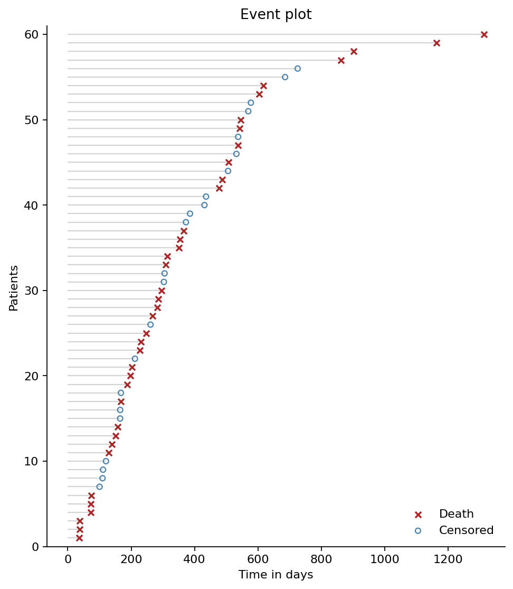
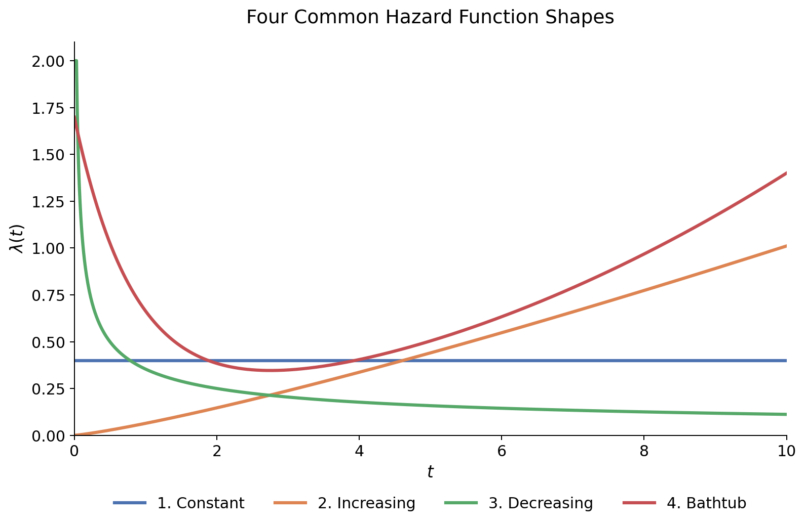
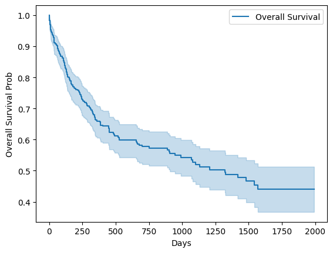
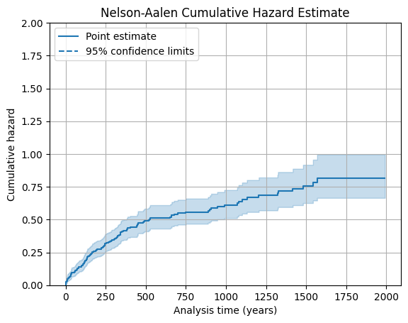
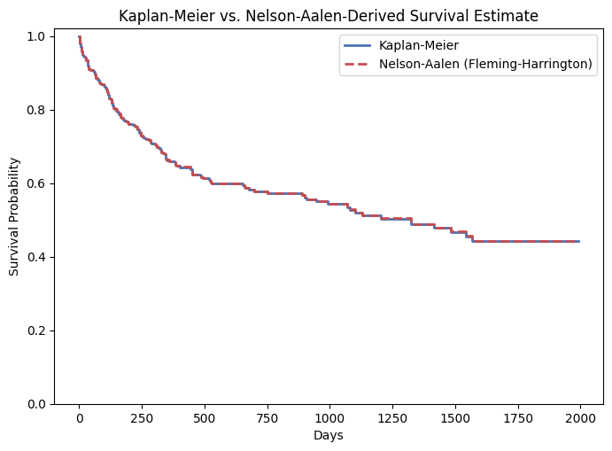

## Introduction - What is Survival Analysis?

In business analytics, we often need to answer questions about when an event is likely to occur. Take a subscription-based business, for instance — leadership might want to know things like:

1. How many customers are expected to churn in the next x days?
2. What is a given customer's expected remaining 'lifetime' with the company?
3. Which customers are at the highest risk of leaving?
4. What's the probability that a new customer stays subscribed for at least x days?
5. What is the expected lifetime of a new customer, or a new customer segment?

These are all versions of the same underlying question: how long until something happens? That's precisely what survival analysis is built to study — the expected duration of time until an event of interest occurs. Because so many real-world problems can be framed this way, survival analysis shows up across a wide range of domains — clinical prognosis, product reliability and failure testing, employee turnover, and customer churn, among others.

The dataset used to answer these questions is called **time-to-event data**, and the analysis is called **survival analysis**, or **Time-to-Event Analysis**. The word "survival" here refers to the time until the event occurs, not necessarily literal survival.

## Time-to-Event Data

When working with time-to-event data, one often defines the **beginning** and **end** of the event of interest. For example, in subscription-based customer churn data, the beginning of the observation is a customer's subscription date, and the end of their observation is when they cancel their subscription. 

In most real-world cases, however, we don't get to observe the beginning and end of the event for all instances. For example, when analyzing employee turnover and time to termination, we often get employees that are still active at the end of the analysis period, thus we don't know when they will actually leave yet. We only know that their true event time is at least as long as some observed value — not the exact value itself. Such feature of time-to-event data is called **censoring**. When the true event time is not observed, we call the cases **right-censored**. When we don't know the beginning date of an observation, we call those cases **left-censored**. 

There are also cases where we wish to study a population that have already survived to a certain point, and we only observe those who have survived past that point. This is called **truncation**. For example, if we only analyze customers who have been subscribed for at least 6 months, then any customer who churns before 6 months is truncated from our dataset.

For this blog and series, we focus on right-censoring, assuming no left-censoring. For more information on censoring and truncation, check Klein and Moeschberger's 
[Survival Analysis: Techniques for Censored and Truncated Data.](https://link.springer.com/book/10.1007/b97377)

### Visualizing Time-to-Event Data 

One way to visualize time-to-event data is to plot each individual's observed duration: a horizontal line running from the beginning to their observed event time or censored time. The plot below uses synthetic data generated for a medical study where patients' outcomes are tracked. The **✕** marks subjects whose line ends because they actually died — we observed their true event time exactly. The **○** marks subjects whose line ends for some other reason — the study ended, they were lost to follow-up, or they were discharged — while they were still alive. 

{width=500px height=600px}

## Describing Event Time Distribution

In the language of statistics, the goal of survival analysis is to describe the distribution of time-to-event T. Think of the distribution of the observed length of the individual timelines on the event plot above. However, instead of studying the probability density function (PDF), survival analysis deals with functions derived from the PDF: 

- Survival Function
- Hazard Function
- Cumulative Hazard Function

### Survival Function

The Survival Function is the probability that the event time T is greater than a specific value t:

$S(t) = Pr(T>t) = 1 - F(t)$

where $F(t)$ is the Cumulative Distribution Function of event time t.

One feature of the survival function is that it is a non-increasing function of time. As time goes on, the probability of surviving past that time decreases. The survival function starts at 1 (100% survival) at time 0 and approaches 0 as time goes to infinity.

The area under the survival function is called the **expected lifetime**, which is defined as:
$$
E[T] = \int_0^\infty S(t)\, dt
$$

It's worth noting that $S(t) = P(T > t)$ is an unconditional probability — the probability of surviving past time $t$, measured from the very start. 

In practice, survival analysis usually deals with subjects who have *already* survived up to some point, and we want to know their chances of continuing to survive further. This requires a conditional version of $S(t)$. Suppose a subject has survived up to time $s$. The probability that they survive to some later time $t > s$ is defined by conditional probability:

$$
P(T > t \mid T > s) = \frac{P(T > t, T > s)}{P(T > s)}
$$

Since $t > s$, the event $\{T > t\}$ already implies $\{T > s\}$ — if you've survived past $t$, you've certainly survived past $s$ too. So the joint event $\{T > t, T > s\}$ simplifies to just $\{T > t\}$:

$$
P(T > t \mid T > s) = \frac{P(T > t)}{P(T > s)} = \frac{S(t)}{S(s)}
$$

This is the **conditional survival property**: the probability of surviving to time $t$, given survival to an earlier time $s$, is simply the ratio of the two unconditional survival probabilities. Intuitively, $S(s)$ represents "how much of the population is still at risk by time $s$," and $S(t)$ represents "how much is still at risk by time $t$" — dividing one by the other rescales the probability to the population that's actually still under observation at time $s$.

### Hazard Function

Besides the distribution of time to event, we also need a function to describe how likely an event can occur at a certain point of time. The 'risk' of the event occurence might increase, remain constant, or decrease over time. In survival analysis, such function is call the Hazard Function, which is defined as:

$$
\lambda(t) = \lim_{h \to 0} \frac{P\big(\text{event in } [t, t+h) \mid \text{no event in } [0,t)\big)}{h}
$$

The hazard function is a measure of the instant **potential** of an event occurring at time t, thus it can be graphed over time. Note that the hazard function can take on any shape to reflect the changing risk over time. The chart below illustrates four shapes of the hazard function.

With different assumptions on the shape of the hazard functions, different types of analysis can be performed. We will examine those techniques in more detail in later posts.

#### Hazard Function and Poisson Process

When I first learned about the hazard function, I was confused as to why it takes the form of a probability divided by a time interval. The limit of such ratio did not make complete sense to me. In most of the tutorials, the hazard function was introduced as a rate without much explanation on why it takes such form. After learning about Poisson Process, I realized the hazard function is actually equivalent to the rate parameter of the Poisson distribution.

::: {.callout-note collapse="false"}

The hazard function arises from a Poisson process, a stochastic process that describes event occurrence. Given a stream of events that arrive at random times starting at $t=0$, let $N_t$ denote the number of arrivals that occur by time $t$, that is, the number of events in $[0,t]$. For instance, $N_t$ might be the number of text messages received up to time $t$. Intuitively speaking, a Poisson process can be thought of as a Poisson distribution with rate parameter $\lambda$ applied over a time period $t$. That is, for all $t > 0$, $N_t$ has a Poisson distribution with parameter $\lambda t$. The Poisson PMF gives the probability of exactly $k$ events in time $t$:

$$
P(N(t) = k) = \frac{(\lambda t)^k e^{-\lambda t}}{k!}
$$

When $k = 0$:

$$
P(N(t) = 0) = \frac{(\lambda t)^0 e^{-\lambda t}}{0!} = e^{-\lambda t}
$$

To understand how $N_t$ behaves locally, consider a short interval of length $h$. Since a Poisson process has stationary increments, the count over any interval of length $h$ has the same distribution as $N(t)$ evaluated at $t = h$. So we can rewrite the above as:

$$
P(N(h) = 0) = e^{-\lambda h}
$$

Now take the Taylor series of $e^{-\lambda h}$ around $h = 0$ and group everything from the quadratic term onward:

$$
e^{-\lambda h} = 1 - \lambda h + \underbrace{\left(\frac{(\lambda h)^2}{2!} - \frac{(\lambda h)^3}{3!} + \cdots\right)}_{\text{this is } o(h)}
$$

which gives:

$$
P(N(h) = 0) = e^{-\lambda h} = 1 - \lambda h + o(h)
$$

The "little-o of $h$" function, $o(h)$, means it shrinks faster than $h$ itself as $h \to 0$:

$$
\lim_{h \to 0} \frac{o(h)}{h} = 0
$$

When $k = 1$:

$$
P(N(h) = 1) = e^{-\lambda h}\lambda h = (1 - \lambda h + o(h))\lambda h = \lambda h - \lambda^2 h^2 + \lambda h \cdot o(h)
$$

It turns out that $\lambda^2 h^2$ is also $o(h)$, since $\lim_{h \to 0} \frac{\lambda^2 h^2}{h} = 0$. Therefore, we have:

$$
P(N(h) = 1) = \lambda h + o(h)
$$

Dividing both sides by $h$ and letting $h \to 0$, we get:

$$
\lim_{h \to 0}\frac{P(N(h) = 1)}{h} = \lambda + \underbrace{\lim_{h \to 0}\frac{o(h)}{h}}_{0} = \lambda
$$

This shows that $\lambda$ is actually the instantaneous rate of a single event occurring in an infinitesimally small window — which is what we'd want a "rate" to mean.

The formulation above assumes a constant rate $\lambda$, giving the same instantaneous probability of an event regardless of how much time has already elapsed. In many real applications, though, the instantaneous event rate does depend on how much time has passed — machines wear out, patients age, components fatigue, thus a time-varying rate $\lambda(t)$.

Formally, $\lambda(t)$ is defined as the instantaneous rate of an event occurring at time $t$, given that no event has occurred before $t$:

$$
\lambda(t) = \lim_{h \to 0} \frac{P\big(\text{event in } [t, t+h) \mid \text{no event in } [0,t)\big)}{h}
$$

This conditional, instantaneous rate (risk of an event) is precisely the hazard function — and it's this conditioning on survival up to time $t$ that distinguishes it from simply restating $\lambda$. In the constant-rate case, the hazard is flat: $\lambda(t) = \lambda$ for all $t$, recovering exactly the Poisson process we started with. In general, $\lambda(t)$ can rise, fall, or vary in shape over time, which is what makes it a flexible building block for modeling real event processes — failures, relapses, deaths — where risk changes over the course of the process.
:::

### Cumulative Hazard Function

The hazard function $\lambda(t)$ tells us the instantaneous risk of an event at a single moment in time, but on its own it doesn't tell us how much risk has built up over a time interval. To answer that, we integrate the hazard over time to get the cumulative hazard function:

$$
\Lambda(t) = \int_0^t \lambda(u)\, du
$$

$\Lambda(t)$ accumulates those infinitesimal risks into a single running total up to time $t$ — much like how integrating speed over time gives you total distance traveled, rather than an instantaneous rate.

### Relationship between the Survival Function and Hazard Function

There's actually a close connection between the survival function $S(t)$ and the hazard function $\lambda(t)$. 

Back to the hazard function:
$$
\lambda(t) = \lim_{h \to 0} \frac{P\big(\text{event in } [t, t+h) \mid \text{no event in } [0,t)\big)}{h}
$$

which in the language of probability means:
$$
\begin{equation}
\lambda(t) = \lim_{h \to 0} \frac{\Pr(t < T \leq t+h \mid T > t)}{h},
\end{equation}
$$

which under the law of conditional probability becomes:
$$
\begin{align}
\lambda(t) &= \lim_{u \to 0} \frac{\Pr(t < T \leq t+h)/\Pr(T > t)}{h} \\
&= \lim_{u \to 0} \frac{[F(t+u) - F(t)]/u}{S(t)} \\
&= \frac{\partial F(t)/\partial t}{S(t)} \\
&= \frac{f(t)}{S(t)},
\end{align}
$$

Based on the result above, we can get a relationship between the survival function and cumulative hazard function. As a stepping stone, let's take derivative of the log of $S(t)$ with respect to $t$:
$$
\frac{\partial \log S(t)}{\partial t} = \frac{\partial S(t)/\partial t}{S(t)} = -\frac{f(t)}{S(t)} = -\lambda(t)
$$

Integrating both sides, we get:
$$
\begin{align}
\int_0^t \lambda(v)\, dv &= -\log S(t). \\[6pt]
\Lambda(t) &= -\log S(t), \\[6pt]
S(t) &= \exp[-\Lambda(t)].
\end{align}
$$

Such connection allows us to estimate the survival function $S(t)$ from the cumulative hazard function $\Lambda(t)$, and vice versa.

### How are these functions used in practice?

Now that we have defined the survival function, hazard function, and cumulative hazard function, we can now revisit the questions that survival analysis is built to answer:

1. What's the probability that a new customer will stay for at least x days? 

This is simply the survival function evaluated at x: $S(x) = P(T > x)$.

2. What is the expected lifetime of a new customer/group?

This is the expected lifetime: $E[T] = \int_0^\infty S(t)\, dt$

3. How many existing customers are expected to leave in the next x days?

This is the conditional probability of leaving in the next x days, given that they have already survived to today. If a customer has already survived to time s, then the probability of leaving in the next x days is:

$P(T > s+x \mid T > s) = \frac{P(T > s+x)}{P(T > s)} = \frac{S(s+x)}{S(s)}$

The expected number of customers leaving in the next x days can be estimated by the sum of these conditional probabilities across all customers who have survived to today.

4. What is a customer's expected remaining 'lifetime' given that they have already survived to today?

Here we need the expected remaining time until the event occurs, given that the subject has already survived to time $t_0$:

\begin{align}
e(t_0) &= \mathbb{E}[T - t_0 \mid T > t_0] \\[4pt]
&= \int_0^\infty P(T - t_0 > u \mid T > t_0)\, du \\[4pt]
&= \int_0^\infty \frac{S(t_0+u)}{S(t_0)}\, du \\[4pt]
&= \frac{1}{S(t_0)} \int_0^\infty S(t_0+u)\, du \\[4pt]
&= \frac{1}{S(t_0)} \int_{t_0}^\infty S(t)\, dt
\end{align}

where $T$ is the event time, $t_0$ is the time already survived, and $T-t_0$ is the remaining time. The expected remaining lifetime can be calculated if the survival function is known, or estimated baseed on simulations. The latter provides more information about the distribution of remaining lifetime, which can be used to calculate percentiles rather than a single expected value.

To get a distribution of remaining lifetime, we can use the conditional survival property to get samples:

We know that the conditional probability of surviving $u$ units of time beyond $t_0$, given survival to $t_0$, is:
$$
P(T - t_0 > u \mid T > t_0) = \frac{S(t_0+u)}{S(t_0)}
$$

To get $u$, we can do the following:
$$
S(t_0+u)= S(t_0) P(T - t_0 > u \mid T > t_0)
$$

Now if we denote the probability $P$ with a uniform random variable $U \sim Uniform(0,1)$, and use the relationship between the survival function and the cumulative hazard function, we can get a sample of $u$ by solving the following equation:

$$
\exp[-\Lambda(t_0+u)] = S(t_0) \cdot U \implies u = \Lambda^{-1}[-\log(S(t_0) \cdot U)] - t_0
$$

where $\Lambda^{-1}$ denotes the inverse of the cumulative hazard function.

The result abvove shows that the distribution of remaining lifetime can be obtained by sampling from a uniform distribution and transforming it through the cumulative hazard function. This allows us to generate a distribution of remaining lifetimes for subjects who have already survived to a certain time point, providing valuable insights into their expected future survival.

## Non-parametric Estimates of Survival and Hazard Functions

So far everything we've discussed has been in terms of the *true*, or *theoretical* survival and hazard functions, which are unknown in practice. When working with real data, we need to estimate these functions from observed event times and censoring information.There are broadly two approaches to estimating survival and hazard functions: parametric and non-parametric. Parametric methods assume a specific distribution for the event times (e.g., exponential, Weibull, log-normal), while non-parametric methods make no such assumptions and instead rely on the observed data to estimate the functions directly.

In this post, we focus on non-parametric estimation, which is particularly useful when we have little prior knowledge about the underlying distribution of event times or when we want to avoid imposing potentially incorrect assumptions.

The most common non-parametric estimators of the survival and hazard functions are the **Kaplan-Meier estimator** and the **Nelson-Aalen estimator**, respectively. Both estimators are built on the same underlying data — the observed event times and the number of subjects at risk at each event time — but they combine that information in different ways to estimate different quantities.

### Kaplan-Meier Estimator

The idea of the Kaplan-Meier estimator is chaining together conditional survival probabilities across small intervals with the conditional survival property.

Suppose we observe $k$ distinct event times $t_1 < t_2 < \cdots < t_k$ in our data (censored observations don't contribute event 
times, but they do affect who remains at risk). At each event time $t_i$, define:

- $n_i$ = the number of subjects still at risk just before $t_i$ (i.e., alive and not yet censored)
- $d_i$ = the number of events that occur exactly at $t_i$

The idea is to estimate the *conditional* probability of surviving past $t_i$, given survival up to just before $t_i$, using the 
simplest possible empirical estimate — the observed proportion:

$$
\widehat{P}(T > t_i \mid T \geq t_i) = \frac{n_i - d_i}{n_i}
$$

Note that censoring is naturally handled here: censored subjects are included in $n_i$ up until their censoring time, but they never contribute to $d_i$ since they don't experience the event.

Now here's where the conditional survival property does its work. Since $S(t)$ can be built up as a chain of conditional survival probabilities across each interval between consecutive event times, we estimate the overall survival function as a product of these per-interval conditional probabilities, for all event times up to and including $t$:

$$
\widehat{S}(t) = \prod_{i:\, t_i \leq t} \frac{n_i - d_i}{n_i}
$$

So with the Kaplan-Meier estimator, each factor in the product represents the estimated probability of "surviving this particular 
interval," and multiplying them together — exactly as the conditional survival identity $P(T>t\mid T>s) = S(t)/S(s)$ suggests.

Here's a simple example to illustrate the Kaplan-Meier estimator:

As visualized, the Kaplan-Meier curve is a step function that drops at each observed event time, with the size of the drop determined by the number of events and the number at risk at that time. 

There are also confidence intervals that can be constructed around the Kaplan-Meier estimate, often using Greenwood's formula to estimate the variance of the survival function. For more details on the Kaplan-Meier estimator, check Kalbfleisch and Prentice's [The Statistical Analysis of Failure Time Data.](https://onlinelibrary.wiley.com/doi/book/10.1002/9781118032985)

### Nelson-Aalen Estimator

Where the Kaplan-Meier estimator targets $S(t)$ directly, the **Nelson-Aalen estimator** estimates the cumulative hazard $\Lambda(t)$ instead — using the exact same at-risk bookkeeping ($n_i$, $d_i$) but combining it differently.

Recall that the cumulative hazard is defined as an integral over the instantaneous hazard:

$$
\Lambda(t) = \int_0^t \lambda(u)\, du
$$

Just as Kaplan-Meier estimates a conditional survival probability at each event time and combines them multiplicatively, Nelson-Aalen estimates the hazard at each event time and combines them additively. At each observed event time $t_i$, the natural empirical estimate of the instantaneous hazard — the "fraction of the at-risk population that experienced the event right now" — is simply:

$$
\widehat{\lambda}(t_i) = \frac{d_i}{n_i}
$$

Since the cumulative hazard is a running sum of instantaneous hazard contributions, the Nelson-Aalen estimator sums these per-interval 
hazard estimates across all event times up to and including $t$:

$$
\widehat{\Lambda}(t) = \sum_{i:\, t_i \leq t} \frac{d_i}{n_i}
$$

Each term $d_i/n_i$ can be thought of as a small "chunk" of accumulated risk contributed at $t_i$ — subjects who are still at risk but experience the event right then. Summing these chunks across time builds up the total accumulated hazard, exactly mirroring how the continuous-time integral $\int_0^t \lambda(u)\,du$ accumulates instantaneous risk. As a result, the NA estimator is a **discrete step function** — it only jumps at observed event times within the node and is flat between them:

$$
\hat{H}(t) = \begin{cases}
0 & t < t_1 \\
\dfrac{d_1}{n_1} & t_1 \leq t < t_2 \\[6pt]
\dfrac{d_1}{n_1} + \dfrac{d_2}{n_2} & t_2 \leq t < t_3 \\[6pt]
\vdots & \\
\displaystyle\sum_{j=1}^{K}\frac{d_j}{n_j} & t \geq t_K
\end{cases}
$$

Here's an example of the Nelson-Aalen estimator:

### Kaplan-Meier vs. Nelson-Aalen

Both estimators are built from the same underlying data — the risk sets $n_i$ and event counts $d_i$ at each observed event time — but 
they combine that information in two structurally different ways:

$$
\widehat{S}_{KM}(t) = \prod_{i:\, t_i \leq t} \left(1 - \frac{d_i}{n_i}\right)
\qquad\text{vs.}\qquad
\widehat{\Lambda}_{NA}(t) = \sum_{i:\, t_i \leq t} \frac{d_i}{n_i}
$$

Recall the identity connecting $S(t)$ and $\Lambda(t)$ that we derived earlier:

$$
S(t) = \exp[-\Lambda(t)]
$$

If we plug the Nelson-Aalen estimate of $\Lambda(t)$ into this identity, we get an alternative estimator of the survival function:

$$
\widehat{S}_{NA}(t) = \exp\left[-\sum_{i:\, t_i \leq t} \frac{d_i}{n_i}\right]
$$

This is sometimes called the **Fleming-Harrington estimator**. It turns out to be numerically very close to $\widehat{S}_{KM}(t)$ in most practical settings, and the two converge to the same quantity asymptotically. Below is a comparison of the Kaplan-Meier and Nelson-Aalen estimates on the same dataset:

In practice, Kaplan-Meier is the more commonly reported estimator of $S(t)$, while Nelson-Aalen is generally preferred as the estimator of $\Lambda(t)$.

## Conclusion

In this blog post, we introduced the fundamentals of survival analysis, including the key concepts of time-to-event data, survival function, hazard function, and cumulative hazard function, and explored their relationships. We also discussed non-parametric estimation methods, specifically the Kaplan-Meier and Nelson-Aalen estimators, which allow us to estimate survival and hazard functions from observed data. The non-parametric estimations serve as a foundation for more advanced survival analysis techniques, which we will explore in subsequent posts.

## References

- R. M. Dobrow. [Introduction to Stochastic Processes with R.](https://onlinelibrary.wiley.com/doi/book/10.1002/9781118740712) Wiley, 2016.
- J. D. Singer, J. B. Willett. [Applied Longitudinal Data Analysis: Modeling Change and Event Occurrence.](https://academic.oup.com/book/41753) Oxford University Press, 2003.
- F. E. Harrell Jr. [Regression Modeling Strategies: With Applications to Linear Models, Logistic and Ordinal Regression, and Survival Analysis.](https://link.springer.com/book/10.1007/978-3-319-19425-7) Springer, 2015.
- D. G. Kleinbaum, M. Klein. [Survival Analysis: A Self-Learning Text, Third Edition.](https://link.springer.com/book/10.1007/978-1-4419-6646-9) Springer, 2012.