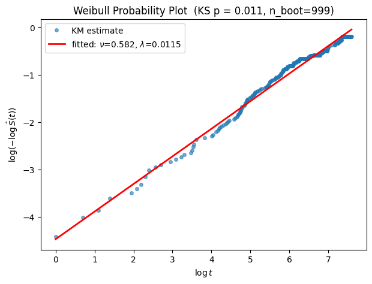
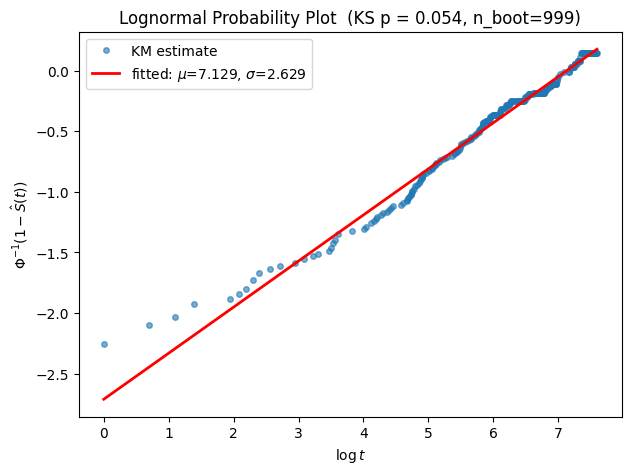
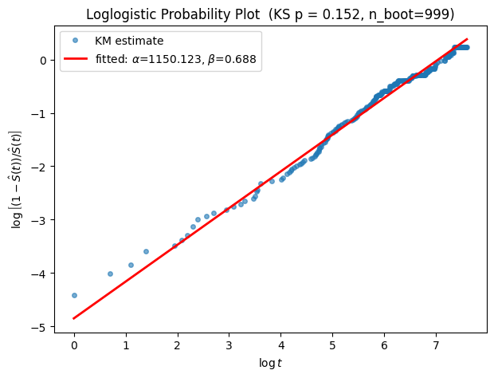

## Introduction - Parametric Distributions

Non-parametric methods are useful for estimating survival functions and hazard functions without making any assumptions about the underlying distribution of event times. However, in many cases, we may wish to gain more insight into the distribution, e.g. describing quantiles, and make predictions about future events. Parametric methods assume that the event times follow a specific probability distribution, and we can use this assumption to estimate the parameters of the distribution and make inferences about the survival function and hazard function.

There are several commonly used parametric distributions in survival analysis, including the exponential, Weibull, log-normal, log-logistic, and Gompertz distributions. Each of these distributions has its own characteristics and assumptions, and the choice of distribution depends on the nature of the data and the research question. In this post, we will discuss the properties of these parametric distributions, and how to assess the goodness-of-fit of the chosen distribution to the observed data. 

## Exponential Distribution

With its origin in the theory of Poisson processes, the exponential distribution is often used to model the time until the first event occurs. The exponential distribution is the simplest parametric survival model as it is characterized by a constant hazard rate, $\lambda$, which means that the probability of an event occurring in the next instant is independent of how long the subject has already survived. This property makes the exponential distribution a useful model for certain types of time-to-event data, such as the time until failure of a mechanical component or the time until death in a population with a constant mortality rate. 

The probability density function (PDF) of the exponential distribution is given by:

$f(t) = \lambda e^{-\lambda t}, \quad t \geq 0$

where $\lambda > 0$ is the rate parameter.

```{python}
#| label: fig-exp-dist
#| fig-cap: "Exponential distribution: PDF, survival, and hazard for varying $\\lambda$"
#| out-width: "100%"

import numpy as np
import matplotlib.pyplot as plt

rates = [0.5, 1.0, 2.0, 4.0]
t = np.linspace(0, 6, 500)

fig, axes = plt.subplots(1, 3, figsize=(8, 2.4))

ax = axes[0]
for lam in rates:
    ax.plot(t, lam * np.exp(-lam * t), label=fr"$\lambda={lam}$")
ax.set_title("Probability Density Function")
ax.set_xlabel("t"); ax.set_ylabel("f(t)"); ax.legend()

ax = axes[1]
for lam in rates:
    ax.plot(t, np.exp(-lam * t), label=fr"$\lambda={lam}$")
ax.set_title("Survival Function")
ax.set_xlabel("t"); ax.set_ylabel("S(t)"); ax.legend()

ax = axes[2]
for lam in rates:
    ax.plot(t, np.full_like(t, lam), label=fr"$\lambda={lam}$")
ax.set_title("Hazard Function (constant)")
ax.set_xlabel("t"); ax.set_ylabel("h(t)"); ax.legend()

plt.tight_layout()
plt.show()

```

The survival function is given by:

$S(t) = e^{-\lambda t}, \quad t \geq 0$

The hazard function is constant and given by:

$h(t) = \lambda, \quad t \geq 0$

The fact that the hazard function is constant implies that the exponential distribution is not suitable for modeling survival data with changing hazard rates over time. To account for such cases, we need parametric distributions whose hazard functions can vary over time, such as the Weibull, log-normal, log-logistic, and Gompertz distributions.

## Weibull Distribution

The Weibull distribution is a versatile continuous probability distribution that can model a wide range of hazard rate behaviors. It can be viewed as a generalization of the exponential distribution, and it is often used in reliability engineering and survival analysis to model the time until failure of a system or component.

The probability density function (PDF) of the Weibull distribution is given by:

$f(t) = \lambda \nu t^{\nu - 1}\exp\left(-\lambda t^\nu\right), \quad t \geq 0$

where $\lambda$ is the scale parameter and $\nu$ is the shape parameter. 

```{python}
#| label: fig-weibull-dist
#| fig-cap: "Weibull distribution: PDF, survival, and hazard for varying $\\nu$"

import numpy as np
import matplotlib.pyplot as plt

lam = 1.0                        # fix scale parameter
nus = [0.5, 1.0, 1.5, 3.0]       # shape parameters to compare
t = np.linspace(0.001, 3, 500)   # start slightly above 0 to avoid t^(nu-1) blowup for nu<1

fig, axes = plt.subplots(1, 3, figsize=(8, 2.4))

ax = axes[0]
for nu in nus:
    pdf = lam * nu * t**(nu - 1) * np.exp(-lam * t**nu)
    ax.plot(t, pdf, label=fr"$\nu={nu}$")
ax.set_title("Weibull PDF ($\\lambda=1$)")
ax.set_xlabel("t"); ax.set_ylabel("f(t)"); ax.legend()

ax = axes[1]
for nu in nus:
    S = np.exp(-lam * t**nu)
    ax.plot(t, S, label=fr"$\nu={nu}$")
ax.set_title("Weibull Survival Function ($\\lambda=1$)")
ax.set_xlabel("t"); ax.set_ylabel("S(t)"); ax.legend()

ax = axes[2]
for nu in nus:
    h = lam * nu * t**(nu - 1)
    ax.plot(t, h, label=fr"$\nu={nu}$")
ax.set_title("Weibull Hazard Function ($\\lambda=1$)")
ax.set_xlabel("t"); ax.set_ylabel("h(t)"); ax.legend()

plt.tight_layout()
plt.show()
```

As the illustrative plot shows above, the Weibull distribution can model increasing, decreasing, or constant hazard rates depending on the value of the shape parameter $\nu$. When $\nu = 1$, the Weibull distribution reduces to the exponential distribution, and the hazard function is constant. When $\nu < 1$, the hazard function decreases over time. When $\nu > 1$ (early-failure/infant mortality), the hazard function increases over time (aging/wear-out). This flexibility makes the Weibull distribution a popular choice for modeling survival data with varying hazard rates.

The survival function of the Weibull distribution is given by:

$S(t) = \exp\left(-\lambda t^\nu\right), \quad t \geq 0$

The hazard function is given by:

$h(t) = \lambda \nu t^{\nu - 1}, \quad t \geq 0$


### Different Parameterizations of Weibull Distribution

This parameterization is usually called the 'rate' parameterization. The Weibull distribution can also be parameterized in terms of a scale parameter $\sigma$ and a shape parameter $k$, where $\sigma = \lambda^{-1/\nu}$ and $k = \nu$. Specifically, the survival function is formulated as:

$\exp\left(-\left(\frac{t}{\sigma_{\text{true}}}\right)^a\right)$

where $a$ is the shape parameter and $\sigma_{\text{true}}$ is the scale parameter. 

The two parameterizations can be confusing enough, to make things worse, different software packages in R and Python use different greek letters to mean the same parameter. 

To make it clear across parameterizations and packages, the table below maps the relationship:

| Convention | Form | Shape ($\nu$) | Scale | Get shape | Get scale |
|---|---|:---:|---|---|---|
| Table I (this blog) | $\exp(-\lambda t^\nu)$ | $\nu$ | $\lambda$ — *not* a true scale; $\lambda = \sigma_{\text{true}}^{-\nu}$ | — | — |
| `rweibull` / `lifelines` | $\exp\left(-(t/\sigma_{\text{true}})^\nu\right)$ | $\nu$ | $\sigma_{\text{true}}$ (genuine scale) | Py: `WeibullFitter().fit().rho_`<br>R: `rweibull(shape=)` | Py: `WeibullFitter().fit().lambda_`<br>R: `rweibull(scale=)` |
| `survreg` (K&P, pre-transform) | $\exp\left(-(\lambda_{KP}\,t)^\nu\right)$ | $\nu$ | $\lambda_{KP}$ — a rate multiplying $t$; internal only | not user-facing | not user-facing |
| `survreg` (reported output) | $(\alpha,\sigma)$ on $\log t$, $\nu=1/\sigma$ | $1/\sigma$ | $e^{\alpha}$ (equals $\sigma_{\text{true}}$) | R: `1/fit$scale` | R: `exp(coef(fit))` |

: Weibull parameterizations across common software conventions. The shape parameter is written $\nu$ throughout, since it is the same quantity in every convention — only the scale changes. {#tbl-weibull-param}

### Graphical Assessment of Weibull Fit

The Weibull distribution has an important property that allows us to assess the goodness-of-fit of the distribution to the observed data. If the event times follow a Weibull distribution, then the following transformation of the survival function should yield a linear relationship:

$$
S(t) = \exp\left(-\lambda t^\nu\right) \implies \ln(-\ln(S(t))) = \ln(\lambda)+\nu \ln(t)
$$

If we use the Kaplan-Meier estimate of the survival function $S(t)$, this property allows for a graphical evaluation of the appropriateness of a Weibull model by plotting the log negative log of the Kaplan-Meier estimate of the survival function against the log of time. If the points fall approximately along a straight line, then the Weibull distribution is a reasonable fit for the data.

## Gompertz Distribution

Even though the Weibull distribution with a $\nu$ greater than 1 can model increasing hazard rates, the hazard growth is polynomial. The Gompertz distribution is another parametric distribution that can model hazard rates that grow exponentially over time, and it is often used in demography and actuarial science to model human mortality.

The probability density function (PDF) of the Gompertz distribution is given by:
$$
f(t) = \lambda e^{\alpha t} \exp\!\left(-\frac{\lambda}{\alpha}\left(e^{\alpha t} - 1\right)\right)
$$

where $\lambda$ is the scale parameter and $\alpha$ is the shape parameter.

The survival function of the Gompertz distribution is given by:
$$
S(t) = \exp\!\left(-\frac{\lambda}{\alpha}\left(e^{\alpha t} - 1\right)\right)
$$

The hazard function is given by:
$$
h(t) = \lambda e^{\alpha t}
$$

With $\alpha > 0$, the hazard function increases exponentially over time.

To see the two different growth patterns, consider the hazard functions of the Weibull and Gompertz distributions:
$$
h(t) = \lambda \nu t^{\nu - 1}
$$

This is $t$ raised to a fixed power. 

$$
h(t) = \lambda e^{\alpha t}
$$

Here $t$ sits in the exponent. As $t$ increases by a fixed amount, $h(t)$ gets multiplied by a fixed factor $e^{\alpha}$, rather than just increasing by some additive/polynomial amount.

Let's visualize some Gompertz distributions with different values of the shape parameter $\alpha$.

```{python}
#| label: fig-gompertz-dist
#| fig-cap: "Gompertz distribution: PDF, survival, and hazard for varying $\\alpha$"

import numpy as np
import matplotlib.pyplot as plt

lam = 1.0
alphas = [-1.0, -0.3, 0.3, 1.0]
t = np.linspace(0.001, 3, 500)

fig, axes = plt.subplots(1, 3, figsize=(8, 2.4))

ax = axes[0]
for alpha in alphas:
    H = (lam / alpha) * (np.exp(alpha * t) - 1)
    pdf = lam * np.exp(alpha * t) * np.exp(-H)
    ax.plot(t, pdf, label=fr"$\alpha={alpha}$")
ax.set_title("Gompertz PDF ($\\lambda=1$)")
ax.set_xlabel("t"); ax.set_ylabel("f(t)"); ax.legend()

ax = axes[1]
for alpha in alphas:
    H = (lam / alpha) * (np.exp(alpha * t) - 1)
    S = np.exp(-H)
    ax.plot(t, S, label=fr"$\alpha={alpha}$")
ax.set_title("Gompertz Survival Function ($\\lambda=1$)")
ax.set_xlabel("t"); ax.set_ylabel("S(t)"); ax.legend()

ax = axes[2]
for alpha in alphas:
    h = lam * np.exp(alpha * t)
    ax.plot(t, h, label=fr"$\alpha={alpha}$")
ax.set_title("Gompertz Hazard Function ($\\lambda=1$)")
ax.set_xlabel("t"); ax.set_ylabel("h(t)"); ax.legend()

plt.tight_layout()
plt.show()


```

## Log-Normal Distribution

The log-normal distribution is often used to model survival data with non-monotonic hazard rates, where the hazard rate initially increases and then decreases over time. This property makes the log-normal distribution suitable for modeling survival data with a peak hazard rate, such as the time until failure of a mechanical component that experiences wear and tear over time.

The log-normal distribution is obtained by taking the logarithm of a normally distributed random variable. We apply the logarithm transformation to event time $T$ and assume the new variable $Y = \ln(T)$ follows a normal distribution with mean $\mu$ and standard deviation $\sigma$: $\log(T) \sim N(\mu, \sigma^2)$.

The probability density function (PDF) of the log-normal distribution is given by:

$f(t) = \frac{1}{t\sigma\sqrt{2\pi}} \exp\left(-\frac{(\ln t - \mu)^2}{2\sigma^2}\right), \quad t > 0$

where $\mu$ and $\sigma$ are the mean and standard deviation of the underlying normal distribution.

The survival function is given by:

$S(t) = 1 - \Phi\left(\frac{\ln t - \mu}{\sigma}\right) = \underbrace{\Phi\left(-\frac{\ln t - \mu}{\sigma}\right)}_{\text{symmetry of standard normal CDF}}, \quad t > 0$

where $\Phi$ is the cumulative distribution function of the standard normal distribution.

The hazard function is given by:

$h(t) = \frac{f(t)}{S(t)} = \frac{\phi\left(\dfrac{\log t - \mu}{\sigma}\right)}{t\sigma\, \Phi\left(-\dfrac{\log t - \mu}{\sigma}\right)}$

```{python}

#| label: fig-lognormal-dist
#| fig-cap: "Log-normal distribution: PDF, survival, and hazard for varying $\\sigma$"

import numpy as np
import matplotlib.pyplot as plt
from scipy.stats import norm

mu = 0.0
sigmas = [0.25, 0.5, 1.0, 1.5]
t = np.linspace(0.001, 6, 1000)

fig, axes = plt.subplots(1, 3, figsize=(8, 2.4))

ax = axes[0]
for sigma in sigmas:
    pdf = (1 / (t * sigma * np.sqrt(2 * np.pi))) * np.exp(-(np.log(t) - mu) ** 2 / (2 * sigma ** 2))
    ax.plot(t, pdf, label=fr"$\sigma={sigma}$")
ax.set_title("Log-normal PDF ($\\mu=0$)")
ax.set_xlabel("t"); ax.set_ylabel("f(t)"); ax.legend()

ax = axes[1]
for sigma in sigmas:
    z = (np.log(t) - mu) / sigma
    S = 1 - norm.cdf(z)
    ax.plot(t, S, label=fr"$\sigma={sigma}$")
ax.set_title("Log-normal Survival Function ($\\mu=0$)")
ax.set_xlabel("t"); ax.set_ylabel("S(t)"); ax.legend()

ax = axes[2]
for sigma in sigmas:
    z = (np.log(t) - mu) / sigma
    S = 1 - norm.cdf(z)
    h = norm.pdf(z) / (t * sigma * S)
    ax.plot(t, h, label=fr"$\sigma={sigma}$")
ax.set_title("Log-normal Hazard Function ($\\mu=0$)")
ax.set_xlabel("t"); ax.set_ylabel("h(t)"); ax.legend()

plt.tight_layout()
plt.show()

```

### Graphical Assessment of Log-Normal Fit

If the event times follow a log-normal distribution, then the following transformation of the survival function should yield a linear relationship:

$$
\Phi^{-1}(S(t)) = \frac{\mu - \ln(t)}{\sigma} = -\frac{1}{\sigma}\ln(t) + \frac{\mu}{\sigma}
$$

That is, if we plot the inverse of the standard normal CDF of the Kaplan-Meier estimate of the survival function against the logarithm of time, we should see a linear relationship if the log-normal distribution is a reasonable fit for the data.

## Log-Logistic Distribution

A cousin of the log-normal distribution is the log-logistic distribution, which is obtained by taking the logarithm of a logistic distributed random variable. We apply the logarithm transformation to event time $T$ and assume the new variable $Y = \ln(T)$ follows a logistic distribution with location parameter $\mu$ and scale parameter $\sigma$: $\log(T) \sim Logistic(\mu, \sigma)$.

The log logistic distribution can be thought of a flexible alternative to the log-normal distribution, as it can not only model non-monotonic hazard rates, but also has a closed-form expression for its survival function and hazard function without having to rely on $\Phi$, making it more tractable for optimization and interpretation.

The probability density function (PDF) of the log-logistic distribution is given by:

$f(t) = \frac{(\beta/\alpha)(t/\alpha)^{\beta-1}}{(1+(t/\alpha)^\beta)^2}, \quad t > 0$

where $\alpha$ is the scale parameter and $\beta$ is the shape parameter.

The survival function is given by:

$S(t) = \frac{1}{1+(t/\alpha)^\beta}, \quad t > 0$

The hazard function is given by:

$h(t) = \frac{(\beta/\alpha)(t/\alpha)^{\beta-1}}{1+(t/\alpha)^\beta}$

Below is an illustrative plot of the log-logistic distribution with different values of the shape parameter $\beta$. As we can see, the log-logistic distribution can model increasing, decreasing, or non-monotonic hazard rates depending on the value of $\beta$.

```{python}
#| label: fig-loglogistic-dist
#| fig-cap: "Log-logistic distribution: PDF, survival, and hazard for varying $\\beta$"

import numpy as np
import matplotlib.pyplot as plt

alpha = 1.0
betas = [0.5, 1.0, 2.0, 4.0]
t = np.linspace(0.001, 6, 1000)

fig, axes = plt.subplots(1, 3, figsize=(8, 2.4))

ax = axes[0]
for beta in betas:
    x = t / alpha
    pdf = (beta / alpha) * x**(beta - 1) / (1 + x**beta) ** 2
    ax.plot(t, pdf, label=fr"$\beta={beta}$")
ax.set_title("Log-logistic PDF ($\\alpha=1$)")
ax.set_xlabel("t"); ax.set_ylabel("f(t)"); ax.legend()

ax = axes[1]
for beta in betas:
    x = t / alpha
    S = 1 / (1 + x**beta)
    ax.plot(t, S, label=fr"$\beta={beta}$")
ax.set_title("Log-logistic Survival Function ($\\alpha=1$)")
ax.set_xlabel("t"); ax.set_ylabel("S(t)"); ax.legend()

ax = axes[2]
for beta in betas:
    x = t / alpha
    h = (beta / alpha) * x**(beta - 1) / (1 + x**beta)
    ax.plot(t, h, label=fr"$\beta={beta}$")
ax.set_title("Log-logistic Hazard Function ($\\alpha=1$)")
ax.set_xlabel("t"); ax.set_ylabel("h(t)"); ax.legend()

plt.tight_layout()
plt.show()


```

### Graphical Assessment of Log-Logistic Fit

To graphically assess the goodness-of-fit of the log-logistic distribution to the observed data, we can use a similar approach as for the Weibull and log-normal distributions. If the event times follow a log-logistic distribution, then the following transformation of the survival function should yield a linear relationship:

$$
S(t) = \frac{1}{1+(t/\alpha)^\beta} \implies \ln(\dfrac{1-S(t)}{S(t)}) = \beta \ln(t) - \beta \ln(\alpha)
$$

That is, if we plot the logit of the Kaplan-Meier estimate of the survival function against the logarithm of time, we should see a linear relationship if the log-logistic distribution is a reasonable fit for the data.

We can now compare all four parametric distributions (Weibull, Gompertz, log-normal, and log-logistic) in one table.

| Characteristic | Exponential | Weibull | Gompertz | Log-normal | Log-logistic |
|---|:---:|:---:|:---:|:---:|:---:|
| Parameter | Scale $\lambda > 0$ | Scale $\lambda > 0$<br>Shape $\nu > 0$ | Scale $\lambda > 0$<br>Shape $-\infty < \alpha < \infty$ | Location $-\infty < \mu < \infty$<br>Scale $\sigma > 0$ | Scale $\alpha > 0$<br>Shape $\beta > 0$ |
| Hazard function | $h_0(t) = \lambda$ | $h_0(t) = \lambda \nu t^{\nu-1}$ | $h_0(t) = \lambda e^{\alpha t}$ | $h(t) = \dfrac{\phi\left(\frac{\log t - \mu}{\sigma}\right)}{t\sigma\,\Phi\left(-\frac{\log t - \mu}{\sigma}\right)}$ | $h(t) = \dfrac{(\beta/\alpha)(t/\alpha)^{\beta-1}}{1+(t/\alpha)^\beta}$ |
| Cumulative hazard | $H_0(t) = \lambda t$ | $H_0(t) = \lambda t^{\nu}$ | $H_0(t) = \dfrac{\lambda}{\alpha}\left(e^{\alpha t} - 1\right)$ | $H(t) = -\log\Phi\left(-\dfrac{\log t - \mu}{\sigma}\right)$ | $H(t) = \log\left(1+(t/\alpha)^\beta\right)$ |

: Characterization of the exponential, Weibull, Gompertz, log-normal, and log-logistic distributions. {#tbl-dists}


::: {.callout-note collapse="true" title="Example Code of Graphical Assessment of GoF"}
```{python}

def probability_plot(durations, event_observed, distribution, fitter=None, ax=None):
    """
    Graphical goodness-of-fit assessment via a linearizing transform of S(t).
    Points roughly linear => the distribution is plausible.
    """
    
    _SPECS = {
    "weibull": (
            lambda S: np.log(-np.log(S)),
            r"$\log(-\log \hat S(t))$",
            lambda f: (f.rho_, -f.rho_ * np.log(f.lambda_)),   
            lambda f: fr"$\nu$={f.rho_:.3f}, $\lambda$={f.lambda_**(-f.rho_):.3g}",
        ),
        "lognormal": (
            lambda S: norm.ppf(1 - S),
            r"$\Phi^{-1}(1-\hat S(t))$",
            lambda f: (1 / f.sigma_, -f.mu_ / f.sigma_),
            lambda f: fr"$\mu$={f.mu_:.3f}, $\sigma$={f.sigma_:.3f}",
        ),
        "loglogistic": (
            lambda S: np.log((1 - S) / S),
            r"$\log\left[(1-\hat S(t))/\hat S(t)\right]$",
            lambda f: (f.beta_, -f.beta_ * np.log(f.alpha_)),
            lambda f: fr"$\alpha$={f.alpha_:.3f}, $\beta$={f.beta_:.3f}",
        )
    }
    
    if distribution not in _SPECS:
        raise ValueError(f"Unknown distribution '{distribution}'. Choose from {list(_SPECS)}.")
    ytrans, ylabel, line_params, label_fmt = _SPECS[distribution]

    kmf = KaplanMeierFitter().fit(durations, event_observed)
    sf = kmf.survival_function_.reset_index()
    sf.columns = ["t", "S"]
    sf = sf[(sf["t"] > 0) & (sf["S"] > 0) & (sf["S"] < 1)]   # guard log(0) / Phi^-1(0,1)

    x = np.log(sf["t"].values)
    y = ytrans(sf["S"].values)

    if ax is None:
        _, ax = plt.subplots(figsize=(7, 5))
    ax.plot(x, y, "o", ms=4, alpha=0.6, label="KM estimate")

    if fitter is not None:
        slope, intercept = line_params(fitter)
        xx = np.linspace(x.min(), x.max(), 100)
        ax.plot(xx, intercept + slope * xx, "r-", lw=2, label=f"fitted: {label_fmt(fitter)}")

    ax.set_xlabel(r"$\log t$")
    ax.set_ylabel(ylabel)
    ax.set_title(f"{distribution.capitalize()} Probability Plot")
    ax.legend()
    return ax

```

:::


## Statistical Goodness-of-Fit Test

In addition to graphical assessment, we can also perform a formal goodness-of-fit test to evaluate how well the chosen distribution fits the observed data.

The KS test is a widely used non-parametric goodness-of-fit test. It compares the empirical distribution function of the observed data with the cumulative distribution function of the fitted model. However, the standard KS test is not directly applicable to censored data, as it does not account for the censoring mechanism. To address this issue, we can use a modified version of the KS test that takes into account the censoring pattern in the data. For this blog,the modified KS test by the R package [GofCens: Goodness-of-Fit Methods for Right-Censored Data.](https://cran.r-project.org/package=GofCens) is implemented in Python.

For implementation details, check out the notes below. 

::: {.callout-note collapse="true" title="Algorithm of KS Test for Right-censored Data"}

The steps for performing the modified KS test for censored data are as follows:

1. Get empirical (KM-based) CDF of original data
2. Fit model to original data → θ̂
3. Get modified KS statistic D_obs, comparing the KM-based empirical CDF (step 1) against the fitted model (step 2)
4. Repeat B times (e.g., B = 999):
   4.1 Simulate event times from the fitted model (θ̂)
   4.2 Simulate censoring times from the reverse-KM estimate of the censoring distribution (fit to the original data's censoring pattern)
   4.3 Build synthetic censored data: min(event, censor),event indicator
   4.4 Refit the model on the synthetic data → θ̂^(b)
   4.5 Get the synthetic data's own KM-based empirical CDF, compute the modified KS statistic D^(b)
5. p-value = proportion of {D^(1), ..., D^(B)} that are ≥ D_obs

:::


::: {.callout-note collapse="true" title="GofCens Implementation of Modified KS Statistic"}

The core challenge of the algorithm lies in step 3 to get the modified KS statistic defined per [R package GofCens: Goodness-of-Fit Methods for Right-Censored Data.](https://upcommons.upc.edu/server/api/core/bitstreams/fa25282f-4444-443e-b6a5-c4baf28cfe01/content):

$$
\hat{D}_n = \sup_{0\leq t\leq t_m}
  \hat{S}_n(t)
  \cdot
  \int_0^t
    \frac{S_0(s;\theta^*)}{\hat{S}_n(s)}
    \;
    d\!\left[\hat{\Lambda}_n(s) - \Lambda_0(s;\theta^*)\right]
$$

Instead of direct evaluation, GofCens actually estimates the quantity by the following:

$$
\hat{D}_n = \sqrt{n}\sup_{0\leq t\leq t_m}
  \underbrace{\hat{S}_n(t)}_{\displaystyle\frac{\hat{S}_n(t)+S_0(t;\theta^*)}{2}}
  \cdot
  \int_0^t
    \underbrace{\frac{S_0(s;\theta^*)}{\hat{S}_n(s)}}_{\displaystyle\sqrt{\tilde{G}(s^-)}}
    \;
    \underbrace{d\!\left[\hat{\Lambda}_n(s)-\Lambda_0(s;\theta^*)\right]}_{\displaystyle
      \log\frac{\hat{S}_n(t_{j-1})}{\hat{S}_n(t_j)}
      \;-\;
      \log\frac{S_0(t_{j-1};\theta^*)}{S_0(t_j;\theta^*)}}
$$

| Equation (1) term | Math formula | Approximated Equation (1) term | R Code |
|---|---|---|---|
| $d\hat\Lambda_n(t_j)$ | $\displaystyle\sum_{k=0}^{d_j-1}\frac{1}{r_j-k}$ | $\log\dfrac{\hat{S}_n(t_{j-1})}{\hat{S}_n(t_j)}$ | `log(svbefor / survT$surv)` |
| $d\Lambda_0(t_j)$ | $\Lambda_0(t_j;\theta^*)-\Lambda_0(t_{j-1};\theta^*)$ | $\log\dfrac{S_0(t_{j-1};\theta^*)}{S_0(t_j;\theta^*)}$ | `log(SofT0(prev) / SofT0(curr))` |
| $\Delta\tilde\Lambda_C(t_j)$ | $\displaystyle\sum_{k=0}^{c_j-1}\frac{1}{r_j-d_j-k}$ | — | `aux2[i]` |
| $\tilde{G}(t_{j-1}^-)$ | $\exp\!\left(-\displaystyle\sum_{i<j}\Delta\tilde\Lambda_C(t_i)\right)$ | — | `alfatj` |
| $\sqrt{\tilde{G}(t_{j-1}^-)}$ | $\sqrt{\exp\!\left(-\displaystyle\sum_{i<j}\sum_{k=0}^{c_i-1}\frac{1}{r_i-d_i-k}\right)}$ | $\dfrac{S_0(s)}{\hat{S}_n(s)}$ | `sqrt(alfatj)` |
| $\dfrac{S_0(s)}{\hat{S}_n(s)}\cdot d[\hat\Lambda_n-\Lambda_0]$ | $\sqrt{\tilde{G}(t_{j-1}^-)}\cdot\bigl(\Delta\hat\Lambda_n(t_j)-\Delta\Lambda_0(t_j)\bigr)$ | $\sqrt{\tilde{G}(t_{j-1}^-)}\!\left(\log\dfrac{\hat{S}_n(t_{j-1})}{\hat{S}_n(t_j)}-\log\dfrac{S_0(t_{j-1})}{S_0(t_j)}\right)$ | `Btj - Atj` |
| $\int_0^{t_k}\dfrac{S_0}{\hat{S}_n}\,d[\hat\Lambda_n-\Lambda_0]$ | $\displaystyle\sum_{t_j\leq t_k}\sqrt{\tilde{G}(t_{j-1}^-)}\cdot\bigl(\Delta\hat\Lambda_n-\Delta\Lambda_0\bigr)(t_j)$ | $\displaystyle\sum_{t_j\leq t_k}\sqrt{\tilde{G}(t_{j-1}^-)}\!\left(\log\dfrac{\hat{S}_n(t_{j-1})}{\hat{S}_n(t_j)}-\log\dfrac{S_0(t_{j-1})}{S_0(t_j)}\right)$ | `Bvec[k] - Avec[k]` |
| $\hat{S}_n(t)$ | $e^{-\hat\Lambda_n(t)}$ | $\dfrac{\hat{S}_n(t)+S_0(t;\theta^*)}{2}$ | `(survT$surv + SofT0(stimes,...)) / 2` |
| $\sqrt{n}\cdot\sup|\cdot|$ | $\sqrt{n}\displaystyle\sup_{0\leq t\leq t_m}|\cdot|$ | $\sqrt{n}\cdot\sup_{t}\left\lvert\dfrac{\hat{S}_n(t^-)+S_0(t)}{2}\cdot\sum_{t_j\leq t}\sqrt{\tilde{G}(t_{j-1}^-)}\,\Delta\right\rvert$ | `sqrt(n) * max(abs(c(Yl, Y, Ym)))` |

: Mapping of Equation (1) terms to `KScens` code {tbl-colwidths="[20,25,32,23]"}

> **Key substitution.** The inner weight $S_0(s)/\hat{S}_n(s)$ is replaced by
> $\sqrt{\tilde{G}(t_{j-1}^-)}$ (`sqrt(alfatj)`). This is the
> variance-stabilising choice: with $w=\sqrt{G}$ the asymptotic variance
> $\int w^2\,d\Lambda_0/(S\cdot G)$ reduces to $\int d\Lambda_0/S$, removing
> $G$ entirely and making the Brownian bridge null distribution hold
> independently of the censoring pattern.

The proof of the estimate involves stochastic calculus and goes beyond the scope of the blog. But here's the exact R code and Python code.

```r
sumSurvT <- survfit(Surv(dat$times, dat$cens) ~ 1, stype = 2, ctype = 2)
survT <- unique(data.frame(times = sumSurvT$time, surv = sumSurvT$surv))
stimes <- survT$time
m <- length(stimes)
svbefor <- c(1, survT$surv[-m])
aux2 <- sapply(1:m, function(i) {
  if (sumSurvT$n.censor[i] > 0) {
    sum(1 / (sumSurvT$n.risk[i] - sumSurvT$n.event[i] - (0:(sumSurvT$n.censor[i] - 1))))
  } else {
    0
  }
})
alfatj <- exp(-c(0, cumsum(aux2))[-m])
Atj <- sqrt(c(1, alfatj[-m])) *
  log(SofT0(c(0, stimes[-m]), alphahat, gammahat, muhat, betahat) /
        SofT0(stimes, alphahat, gammahat, muhat, betahat))
Atj[is.nan(Atj)] <- 0
Avec <- cumsum(Atj)
Btj <- sqrt(c(1, alfatj[-m])) * log(svbefor / survT$surv)
Btj[is.nan(Btj)] <- 0
Bvec <- cumsum(Btj)
Yl <- sqrt(n) / 2 * (svbefor + SofT0(stimes, alphahat, gammahat, muhat, betahat)) *
  (Avec - c(0, Bvec[-m])) * ifelse(Bvec > 0, 1, 0)
Y <-  sqrt(n) / 2 * (survT$surv + SofT0(stimes, alphahat, gammahat, muhat, betahat)) *
  (Avec - Bvec) * ifelse(Bvec > 0, 1, 0)
Ym <- sqrt(n) / 2 * (survT$surv[m] + SofT0(stimes[m], alphahat, gammahat, muhat,
                                           betahat)) * (Avec[m] - Bvec[m])
A <- max(abs(c(Yl, Y, Ym)))
return(A)
```

Now the Python re-implementation:

```{python}
import numpy as np
from lifelines import KaplanMeierFitter

def modified_ks_statistic(times, events, param_survival_fn):
    """
    Fleming et al. (1980) modified KS statistic for right-censored data,
    replicating GofCens::KScens (stype=2, ctype=2).

    times  : observed durations
    events : 1 = event, 0 = censored
    param_survival_fn : vectorized callable S0(t)
    """
    times = np.asarray(times, dtype=float)
    events = np.asarray(events, dtype=int)
    n = len(times)

    et = KaplanMeierFitter().fit(times, events).event_table
    et = et[et.index > 0]
    stimes   = et.index.values.astype(float)
    n_risk   = et["at_risk"].values.astype(float)
    n_event  = et["observed"].values.astype(float)
    n_censor = et["censored"].values.astype(float)
    m = len(stimes)

    # --- Nelson-Aalen, Fleming-Harrington tie correction (ctype=2) ---
    dH = np.array([
        np.sum(1.0 / (n_risk[i] - np.arange(n_event[i]))) if n_event[i] > 0 else 0.0
        for i in range(m)
    ])
    # stype=2: S_hat = exp(-H_hat) -- strictly positive, unlike product-limit
    surv = np.exp(-np.cumsum(dH))
    svbefor = np.concatenate(([1.0], surv[:-1]))

    # --- estimated censoring survival G_hat(t_{j-1}) ---
    denom = n_risk - n_event
    hazard_incre = np.zeros(m)
    for i in range(m):
        if n_censor[i] > 0 and denom[i] > 0:
            d = denom[i] - np.arange(n_censor[i])
            hazard_incre[i] = np.sum(1.0 / d[d > 0]) if np.any(d > 0) else 0.0
    G_hat = np.exp(-np.concatenate(([0.0], np.cumsum(hazard_incre)))[:-1])

    w = np.sqrt(np.concatenate(([1.0], G_hat[:-1])))

    S0_s = np.asarray(param_survival_fn(stimes), dtype=float)
    S0_p = np.asarray(param_survival_fn(np.concatenate(([0.0], stimes[:-1]))), dtype=float)

    def safe_log_ratio(num, den):
        out = np.zeros_like(num)
        ok = (num > 0) & (den > 0)
        out[ok] = np.log(num[ok] / den[ok])
        return out

    Avec = np.cumsum(w * safe_log_ratio(S0_p, S0_s))     # parametric H0
    Bvec = np.cumsum(w * safe_log_ratio(svbefor, surv))  # empirical  H_hat

    ind = (Bvec > 0).astype(float)
    Yl = np.sqrt(n)/2 * (svbefor + S0_s) * (Avec - np.concatenate(([0.0], Bvec[:-1]))) * ind
    Y  = np.sqrt(n)/2 * (surv + S0_s) * (Avec - Bvec) * ind
    Ym = np.sqrt(n)/2 * (surv[-1] + S0_s[-1]) * (Avec[-1] - Bvec[-1])

    return float(np.max(np.abs(np.concatenate((Yl, Y, [Ym])))))
```

:::


::: {.callout-note collapse="true" title="Python Implementation of Modified KS Test"}
```{python}
"""
Full modified Kolmogorov-Smirnov test for right-censored data,
replicating GofCens::KScens (Besalu et al. 2025, The R Journal 17(3)).
"""
import numpy as np
from lifelines import (KaplanMeierFitter, ExponentialFitter, WeibullFitter,LogNormalFitter, LogLogisticFitter)
from scipy.stats import norm

# ---------------------------------------------------------------- Step 2
def fit_distribution(durations, event_observed, distribution):
    dist_register = {
        'exponential': ExponentialFitter(),
        'weibull': WeibullFitter(),
        'lognormal': LogNormalFitter(),
        'loglogistic': LogLogisticFitter(),
    }
    if distribution not in dist_register:
        raise ValueError(f"Unknown distribution '{distribution}'. Choose from {list(dist_register)}.")
    fitter = dist_register[distribution]
    fitter.fit(durations=durations, event_observed=event_observed)
    return fitter


def _S0_from_fitter(fitter):
    """Any fitted lifelines univariate fitter already knows its own S(t)."""
    return lambda t: fitter.survival_function_at_times(np.asarray(t, dtype=float)).values


# ---------------------------------------------------------------- Step 3
def modified_ks_statistic(times, events, param_survival_fn):
    """
    Fleming et al. (1980) modified KS statistic for right-censored data,
    replicating GofCens::KScens (stype=2, ctype=2).

    times  : observed durations
    events : 1 = event, 0 = censored
    param_survival_fn : vectorized callable S0(t)
    """
    times = np.asarray(times, dtype=float)
    events = np.asarray(events, dtype=int)
    n = len(times)

    et = KaplanMeierFitter().fit(times, events).event_table
    et = et[et.index > 0]
    stimes   = et.index.values.astype(float)
    n_risk   = et["at_risk"].values.astype(float)
    n_event  = et["observed"].values.astype(float)
    n_censor = et["censored"].values.astype(float)
    m = len(stimes)

    # --- Nelson-Aalen, Fleming-Harrington tie correction (ctype=2) ---
    dH = np.array([
        np.sum(1.0 / (n_risk[i] - np.arange(n_event[i]))) if n_event[i] > 0 else 0.0
        for i in range(m)
    ])
    # stype=2: S_hat = exp(-H_hat) -- strictly positive, unlike product-limit
    surv = np.exp(-np.cumsum(dH))
    svbefor = np.concatenate(([1.0], surv[:-1]))

    # --- estimated censoring survival G_hat(t_{j-1}) ---
    denom = n_risk - n_event
    hazard_incre = np.zeros(m)
    for i in range(m):
        if n_censor[i] > 0 and denom[i] > 0:
            d = denom[i] - np.arange(n_censor[i])
            hazard_incre[i] = np.sum(1.0 / d[d > 0]) if np.any(d > 0) else 0.0
    G_hat = np.exp(-np.concatenate(([0.0], np.cumsum(hazard_incre)))[:-1])

    w = np.sqrt(np.concatenate(([1.0], G_hat[:-1])))

    S0_s = np.asarray(param_survival_fn(stimes), dtype=float)
    S0_p = np.asarray(param_survival_fn(np.concatenate(([0.0], stimes[:-1]))), dtype=float)

    def safe_log_ratio(num, den):
        out = np.zeros_like(num)
        ok = (num > 0) & (den > 0)
        out[ok] = np.log(num[ok] / den[ok])
        return out

    Avec = np.cumsum(w * safe_log_ratio(S0_p, S0_s))     # parametric H0
    Bvec = np.cumsum(w * safe_log_ratio(svbefor, surv))  # empirical  H_hat

    ind = (Bvec > 0).astype(float)
    Yl = np.sqrt(n)/2 * (svbefor + S0_s) * (Avec - np.concatenate(([0.0], Bvec[:-1]))) * ind
    Y  = np.sqrt(n)/2 * (surv + S0_s) * (Avec - Bvec) * ind
    Ym = np.sqrt(n)/2 * (surv[-1] + S0_s[-1]) * (Avec[-1] - Bvec[-1])

    return float(np.max(np.abs(np.concatenate((Yl, Y, [Ym])))))


# ---------------------------------------------------------------- Step 4.1 / 4.2 helpers
def _simulate_event_times(fitter, distribution, u):
    """Inverse-CDF draw from the fitted null, using each fitter's own parameterization."""
    u = np.asarray(u, dtype=float)
    if distribution == 'exponential':
        return -fitter.lambda_ * np.log(u)
    if distribution == 'weibull':
        return fitter.lambda_ * (-np.log(u)) ** (1.0 / fitter.rho_)
    if distribution == 'lognormal':
        return np.exp(fitter.mu_ + fitter.sigma_ * norm.ppf(1 - u))
    if distribution == 'loglogistic':
        return fitter.alpha_ * ((1 - u) / u) ** (1.0 / fitter.beta_)
    raise ValueError(f"No sampler registered for '{distribution}'")


def _sample_from_km(km_fitter, u):
    """Inverse-transform sampling from a fitted KaplanMeierFitter step function."""
    surv = km_fitter.survival_function_
    t_grid = surv.index.values
    S_vals = surv.iloc[:, 0].values
    target = 1 - np.asarray(u, dtype=float)
    idx = np.searchsorted(-S_vals, -target, side="left")
    out = np.full_like(target, np.inf, dtype=float)
    valid = idx < len(t_grid)
    out[valid] = t_grid[idx[valid]]
    return out


# ---------------------------------------------------------------- Steps 4-5
def ks_censored_test(durations, event_observed, distribution, B=999, rng=None):
    """
    Modified KS test for right-censored data (Fleming et al. 1980 / GofCens::KScens).

    Returns dict with D_obs, p_value, fitted params, and the bootstrap distribution.
    """
    durations = np.asarray(durations, dtype=float)
    event_observed = np.asarray(event_observed, dtype=int)
    n = len(durations)
    rng = np.random.default_rng() if rng is None else rng

    # --- Step 2: fit null model, Step 3: observed statistic ---
    fitter = fit_distribution(durations, event_observed, distribution)
    S0 = _S0_from_fitter(fitter)
    D_obs = modified_ks_statistic(durations, event_observed, S0)

    # --- reverse-KM estimate of the censoring distribution (fixed across replicates) ---
    censKM = KaplanMeierFitter().fit(durations, 1 - event_observed)

    # --- Step 4: bootstrap ---
    D_boot = np.empty(B)
    b = 0
    attempts = 0
    while b < B and attempts < 10 * B:
        attempts += 1
        u_t = rng.uniform(size=n)
        u_c = rng.uniform(size=n)
        T_b = _simulate_event_times(fitter, distribution, u_t)
        C_b = _sample_from_km(censKM, u_c)
        X_b = np.minimum(T_b, C_b)
        delta_b = (T_b < C_b).astype(int)

        if delta_b.sum() < 2:            # refit needs at least a couple of events
            continue
        try:
            fitter_b = fit_distribution(X_b, delta_b, distribution)
            S0_b = _S0_from_fitter(fitter_b)
            D_boot[b] = modified_ks_statistic(X_b, delta_b, S0_b)
        except Exception:
            continue
        b += 1

    if b < B:
        D_boot = D_boot[:b]

    # --- Step 5: p-value (Besalu et al. 2025, matches paper's +1/+1 correction) ---
    p_value = (np.sum(D_obs <= D_boot) + 1) / (len(D_boot) + 1)

    return {
        "D_obs": D_obs,
        "p_value": p_value,
        "params": dict(fitter.params_),
        "n_boot": len(D_boot),
        "D_boot": D_boot,
    }

```

:::


## Case Study

We now apply the concepts discussed above to a real-world dataset which contains survival times and censoring information for patients with a specific medical condition. Three distributions, Weibull, Log-normal, and Log-logistic, are fit to the data, and their goodness-of-fit is assessed using both graphs and the modified KS test (p-value printed next to the plot title). According to the KS test results, Weibull and Log-normal don't seem to be a good fit despite their moderate graphical fit. The Log-logistic distribution seems plausible.

```{python}
def gof_assessment(durations, event_observed, distribution, B=999, ax=None, rng=None):
    # fit once, share
    fitter = fit_distribution(durations, event_observed, distribution)

    # KS test (uses fitter internally via ks_censored_test, but you could
    # refactor to accept a pre-fitted fitter to avoid the second fit)
    result = ks_censored_test(durations, event_observed, distribution, B=B, rng=rng)

    # probability plot, passing the fitter so the theoretical line is drawn
    ax = probability_plot(durations, event_observed, distribution, fitter=fitter, ax=ax)

    # annotate the plot with the p-value
    ax.set_title(
        f"{distribution.capitalize()} Probability Plot  "
        f"(KS p = {result['p_value']:.3f}, n_boot={result['n_boot']})"
    )

    return ax

```

::: {#fig-gof-comparison layout-ncol="3"}







Goodness-of-fit comparison: probability plots with KS test p-values
:::

It is worth noting that so far everything has been performed on the dataset level, no individual variables are considered yet. Passing a population-level goodness-of-fit test doesn't guarantee the same result for the population's subgroup based on the values of variables. That's where we will pick next — building and validating Proportional Hazards (PH) and Accelerated Failure Time (AFT) models.

## Conclusion 

In this post, we discussed several commonly used parametric distributions — exponential, Weibull, Gompertz, log-normal, and log-logistic, and applied both a graphical probability plot and a modified KS test.


## References

- F. E. Harrell Jr. [Regression Modeling Strategies: With Applications to Linear Models, Logistic and Ordinal Regression, and Survival Analysis.](https://link.springer.com/book/10.1007/978-3-319-19425-7) Springer, 2015.
- D. G. Kleinbaum, M. Klein. [Survival Analysis: A Self-Learning Text, Third Edition.](https://link.springer.com/book/10.1007/978-1-4419-6646-9) Springer, 2012.
- T. R. Fleming, J. R. O'Fallon, P. C. O'Brien, D. P. Harrington. [Modified Kolmogorov-Smirnov test procedures with application to arbitrarily right-censored data.](https://doi.org/10.2307/2556114) Biometrics, 36(4), 607-625, 1980.
- B. Efron. Censored data and the bootstrap. Journal of the American Statistical Association, 76(374), 312-319, 1981.
- M. Besalú, K. Langohr, M. Francisco, A. Garcia-Fernández, G. Gómez Melis. [R package GofCens: Goodness-of-Fit Methods for Right-Censored Data.](https://upcommons.upc.edu/server/api/core/bitstreams/fa25282f-4444-443e-b6a5-c4baf28cfe01/content) The R Journal, 17(3), 100-124, 2025.
- K. Langohr, M. Besalú, M. Francisco, A. Garcia, G. Gómez. [GofCens: Goodness-of-Fit Methods for Right-Censored Data.](https://cran.r-project.org/package=GofCens) R package, CRAN.
- A. Garcia. [GofCens source repository.](https://github.com/ArnauGarciaGRBIO/GofCens) GitHub.